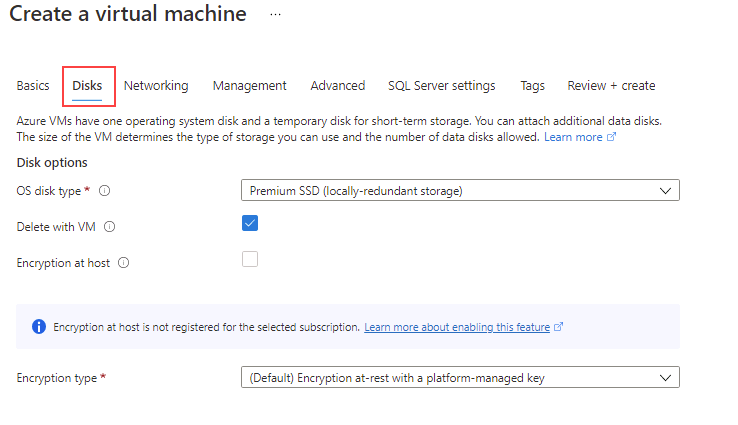

---
lab:
  title: 'Lab 1: Bereitstellen von SQL Server auf einer Azure-VM'
  module: Plan and Implement Data Platform Resources
---

# Bereitstellen von SQL Server auf einer Azure-VM

**Geschätzte Dauer: 30 Minuten**

Die Kursteilnehmer erkunden das Azure-Portal und verwenden es zum Erstellen einer Azure-VM, auf der SQL Server 2019 installiert ist. Dann stellen sie über das Remotedesktopprotokoll eine Verbindung mit einem virtuellen Computer her.

Sie sind der Datenbankadministrator für AdventureWorks. Sie müssen eine Testumgebung erstellen, die für eine Machbarkeitsstudie verwendet werden kann. Für die Machbarkeitsstudie werden SQL Server auf einer Azure-VM und ein Backup der AdventureWorksDW-Datenbank verwendet. Sie müssen den virtuellen Computer einrichten, die Datenbank wiederherstellen und abfragen, um sicherzustellen, dass sie verfügbar ist.

## Bereitstellen von SQL Server auf einer Azure-VM

1. Starten Sie auf dem virtuellen Lab-Computer eine Browsersitzung, navigieren Sie zu [https://portal.azure.com](https://portal.azure.com/), und melden Sie sich mit dem Microsoft-Konto an, das Ihrem Azure-Abonnement zugeordnet ist.

    

1. Suchen Sie oben auf der Seite nach der Suchleiste. Suchen Sie nach **Azure SQL**. Wählen Sie das unter **Dienste** angezeigte Suchergebnis für **Azure SQL**.

    

1. Wählen Sie auf dem Blatt **Azure Cosmos DB** die Option **Erstellen** aus.

    

1. Öffnen Sie auf dem Blatt **SQL-Bereitstellungsoption auswählen** das Dropdownfeld unter **SQL-VMs**. Wählen Sie den Softwareplan **Free SQL Server License: SQL 2019 Developer on Windows Server 2022** (Kostenlose SQL Server-Lizenz: SQL 2019-Entwickler unter Windows Server 2022) aus. Wählen Sie dann **Erstellen** aus.

    

1. Geben Sie auf der Seite **Einen virtuellen Computer erstellen** die folgenden Informationen ein:

    - **Abonnement:** &lt;Ihr Abonnement&gt;
    - **Ressourcengruppe:** &lt;Ihre Ressourcengruppe&gt;
    - **VM-Name:** azureSQLServerVM
    - **Region:** &lt;Ihre lokale Region, identisch mit der für Ihre Ressourcengruppe ausgewählten Region&gt;
    - **Verfügbarkeitsoptionen**: Keine Infrastrukturredundanz erforderlich
    - **Bild:** Kostenlose SQL Server-Lizenz: SQL 2019 Developer unter Windows Server 2022 – Gen1
    - **Azure-Spotinstanz:** Nein (deaktiviert)
    - **Größe:** Standard *D2s v3* (2 VCPUs, 8 GiB Arbeitsspeicher) Möglicherweise müssen Sie den Link „Alle Größen anzeigen“ auswählen, um diese Option zu sehen)
    - **Benutzername des Administratorkontos:** sqladmin
    - **Kennwort des Administratorkontos:** pwd!DP300lab01 (oder Ihr eigenes Kennwort, das die Kriterien erfüllt)
    - **Eingangsports auswählen:** RDP (3389)
    - **Möchten Sie eine vorhandene Windows Server-Lizenz verwenden?:** Nein (deaktiviert)

    Notieren Sie sich den Benutzernamen und das Kennwort zur späteren Verwendung.

    

1. Navigieren Sie zur Registerkarte **Datenträger**, und überprüfen Sie die Konfiguration.

    

1. Navigieren Sie zur Registerkarte **Netzwerke**, und überprüfen Sie die Konfiguration.

    

1. Navigieren Sie zur Registerkarte **Verwaltung**, und überprüfen Sie die Konfiguration.

    

    Vergewissern Sie sich, dass **„Auto_shutdown aktivieren"** deaktiviert ist.

1. Navigieren Sie zur Registerkarte **Erweitert**, und überprüfen Sie die Konfiguration.

    

1. Navigieren Sie zur Registerkarte **SQL Server-Einstellungen**, und überprüfen Sie die Konfiguration.

    

    **Hinweis:** Auf diesem Bildschirm können Sie auch den Speicher für Ihre SQL Server-VM konfigurieren. Die Vorlagen für SQL Server auf einer Azure-VM erstellen standardmäßig einen Premium-Datenträger mit einem Lesecache für Daten sowie einen Premium-Datenträger ohne Cache für das Transaktionsprotokoll und verwendet den lokalen SSD-Datenträger (D:\ unter Windows) für die tempdb.

1. Wählen Sie die Schaltfläche **Überprüfen + erstellen** aus. Wählen Sie dann **Erstellen** aus.

    

1. Warten Sie auf dem Blatt „Bereitstellung“, bis die Bereitstellung abgeschlossen ist. Die Bereitstellung der VM dauert etwa 5 bis 10 Minuten. Wenn Ihre Bereitstellung abgeschlossen ist, wählen Sie **Go to resource** (Zu Ressource wechseln) aus.

    **Hinweis:** Die Bereitstellung kann mehrere Minuten dauern.

    

1. Scrollen Sie auf der **Übersichtsseite** für die VM durch die Menüoptionen für die Ressource, um die verfügbaren Optionen zu überprüfen.

    

## Herstellen einer Verbindung mit SQL Server auf einer Azure-VM

1. Wählen Sie auf der Seite **Übersicht** für den virtuellen Computer die Option **Verbinden**.

1. Wählen Sie im Bereich „Verbinden“ die Schaltfläche **RDP-Datei herunterladen** aus.

    

    **Hinweis:** Wenn der Fehler angezeigt wird, dass der **vorausgesetzte Port nicht verfügbar** ist. Stellen Sie sicher, dass Sie den Link auswählen, um eine Sicherheitsgruppenregel für eingehende Netzwerke mit dem Zielport hinzuzufügen, der im Feld *Portnummer* erwähnt wird.

    

1. Öffnen Sie die heruntergeladene RDP-Datei. Wenn Sie in einem Dialogfeld gefragt werden, ob Sie eine Verbindung herstellen möchten, wählen Sie **Verbinden** aus.

    

1. Geben Sie während des Bereitstellungsprozesses des virtuellen Computers den Benutzernamen und das Kennwort ein. Wählen Sie dann **OK** aus.

    

1. Wenn Sie im Dialogfeld **Remotedesktop verbinden** gefragt werden, ob Sie eine Verbindung herstellen möchten, wählen Sie **Ja** aus.

    

1. Wählen Sie die Windows-Starttaste und geben Sie SSMS ein. Wählen Sie **Microsoft SQL Server Management Studio** von der Liste aus.  

1. Wenn SSMS geöffnet wird, beachten Sie, dass das Dialogfeld **Mit Server verbinden** mit dem Standardinstanznamen vorausgefüllt ist. Aktivieren Sie die Option **Serverzertifikat vertrauen** und wählen Sie dann **Verbinden**.

    

Das Azure-Portal bietet Ihnen leistungsstarke Tools für die Verwaltung einer SQL Server-Instanz, die auf einer VM gehostet wird. Diese Tools umfassen die Kontrolle über das automatisierte Patchen, automatisierte Sicherungen und eine einfache Möglichkeit zum Einrichten der Hochverfügbarkeit.
