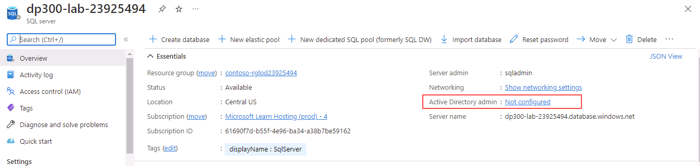
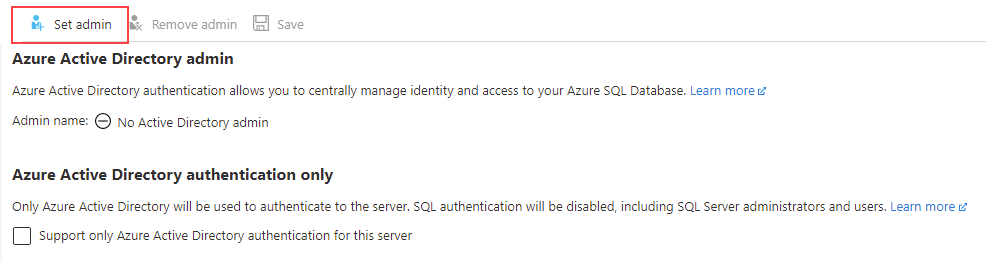

---
lab:
  title: 'Lab 3: Autorisieren des Zugriffs auf Azure SQL-Datenbank mithilfe von Azure Active Directory'
  module: Implement a Secure Environment for a Database Service
---

# Konfigurieren der Datenbankauthentifizierung und -autorisierung

**Geschätzte Dauer**: 20 Minuten

Die Kursteilnehmer nutzen die in den Lektionen erworbenen Informationen, um die Sicherheit im Azure-Portal und in der *AdventureWorks-Datenbank* zu konfigurieren und anschließend zu implementieren.

Sie wurden als verantwortlicher Datenbankadministrator eingestellt, um die Sicherheit der Datenbankumgebung zu gewährleisten.

**Hinweis:** In diesen Übungen werden Sie aufgefordert, T-SQL-Code zu kopieren und einzufügen. Überprüfen Sie, ob der Code korrekt kopiert wurde, bevor Sie ihn ausführen.

## Autorisieren des Zugriffs auf Azure SQL-Datenbank mittels Azure Active Directory

1. Starten Sie auf dem virtuellen Lab-Computer eine Browsersitzung, und navigieren Sie zu [https://portal.azure.com](https://portal.azure.com/). Stellen Sie eine Verbindung zum Portal her. Verwenden Sie dafür **Benutzernamen** und **Kennwort** von Azure, die auf der Registerkarte **Ressourcen** für diesen virtuellen Lab-Computer bereitgestellt werden.

    

1. Wählen Sie auf der Startseite des Azure-Portals **Alle Ressourcen** aus.

    

1. Wählen Sie den Azure SQL-Datenbankserver **dp300-lab-xxxxxx**, wobei **xxxxxx** eine zufällige Zeichenfolge ist. Wählen Sie dann **Nicht konfiguriert** neben **Active Directory-Administrator**.

    

1. Wählen Sie im nächsten Bildschirm **Administrator festlegen** aus.

    

1. Suchen Sie in der Seitenleiste **Azure Active Directory** nach dem Azure-Benutzernamen, mit dem Sie sich beim Azure-Portal angemeldet haben, und klicken Sie dann auf **Auswählen**.

1. Wählen Sie **Speichern** aus, um den Vorgang abzuschließen. Dadurch wird Ihr Benutzername zum Azure Active Directory-Administrator für den Server, wie unten gezeigt.

    

1. Wählen Sie auf der linken Seite **Übersicht** aus, und kopieren Sie dann den **Servernamen**.

    

1. Öffnen Sie SQL Server Management Studio, und wählen Sie **Verbinden** > **Datenbank-Engine** aus. Fügen Sie in das Feld **Servername** den Namen Ihres Servers ein. Ändern Sie den Authentifizierungstyp in **Azure Active Directory: universell mit MFA**.

    

    Wählen Sie unter **Benutzername** den **Azure-Benutzernamen** auf der Registerkarte **Ressourcen** aus.

1. Wählen Sie **Verbinden**.

> [!NOTE]
> Wenn Sie zum ersten Mal versuchen, sich bei einer Azure SQL-Datenbank anzumelden, muss Ihre Client-IP-Adresse zur Firewall hinzugefügt werden. Dies kann SQL Server Management Studio für Sie übernehmen. Verwenden Sie das **Kennwort** des Azure-Portals von der Registerkarte **Ressourcen**, wählen Sie dann **Anmelden**, Ihre Azure-Anmeldedaten und schließlich **OK** aus.
> 

## Verwalten des Zugriffs auf Datenbankobjekte

In dieser Aufgabe verwalten Sie den Zugriff auf die Datenbank und deren Objekte. Als Erstes erstellen Sie zwei Benutzer in der Datenbank *AdventureWorksLT*.

1. Verwenden Sie den **Objekt-Explorer**, und erweitern Sie **Datenbanken**.
1. Klicken Sie mit der rechten Maustaste auf **AdventureWorksLT**, und wählen Sie **Neue Abfrage** aus.

    

1. Kopieren Sie im Fenster „Neue Abfrage“ den folgenden T-SQL, und fügen Sie ihn ein. Führen Sie die Abfrage aus, um die beiden Benutzer zu erstellen.

    ```sql
    CREATE USER [DP300User1] WITH PASSWORD = 'Azur3Pa$$';
    GO

    CREATE USER [DP300User2] WITH PASSWORD = 'Azur3Pa$$';
    GO
    ```

    **Hinweis:** Beachten Sie, dass diese Benutzer im Geltungsbereich der AdventureWorksLT-Datenbank erstellt werden. Als Nächstes erstellen Sie eine benutzerdefinierte Rolle, und fügen ihr die Benutzer hinzu.

1. Führen Sie den folgenden T-SQL-Code im selben Abfragefenster aus.

    ```sql
    CREATE ROLE [SalesReader];
    GO

    ALTER ROLE [SalesReader] ADD MEMBER [DP300User1];
    GO

    ALTER ROLE [SalesReader] ADD MEMBER [DP300User2];
    GO
    ```

    Erstellen Sie als Nächstes eine neue gespeicherte Prozedur im Schema **SalesLT**.

1. Führen Sie den folgenden T-SQL-Code in Ihrem Abfragefenster aus.

    ```sql
    CREATE OR ALTER PROCEDURE SalesLT.DemoProc
    AS
    SELECT P.Name, Sum(SOD.LineTotal) as TotalSales ,SOH.OrderDate
    FROM SalesLT.Product P
    INNER JOIN SalesLT.SalesOrderDetail SOD on SOD.ProductID = P.ProductID
    INNER JOIN SalesLT.SalesOrderHeader SOH on SOH.SalesOrderID = SOD.SalesOrderID
    GROUP BY P.Name, SOH.OrderDate
    ORDER BY TotalSales DESC
    GO
    ```

    Verwenden Sie als nächstes die Syntax `EXECUTE AS USER`, um die Sicherheit zu testen. Dies ermöglicht es der Datenbank-Engine, eine Abfrage im Kontext Ihres Benutzers auszuführen.

1. Führen Sie den folgenden T-SQL-Code aus.

    ```sql
    EXECUTE AS USER = 'DP300User1'
    EXECUTE SalesLT.DemoProc
    ```

    Dies schlägt mit folgender Meldung fehl:

    

1. Gewähren Sie als Nächstes der Rolle Berechtigungen zum Ausführen der gespeicherten Prozedur. Führen Sie den folgenden T-SQL-Code aus.

    ```sql
    REVERT;
    GRANT EXECUTE ON SCHEMA::SalesLT TO [SalesReader];
    GO
    ```

    Der erste Befehl kehrt den Ausführungskontext wieder zurück in den Datenbankbesitzer um.

1. Führen Sie den vorherigen T-SQL-Code erneut aus.

    ```sql
    EXECUTE AS USER = 'DP300User1'
    EXECUTE SalesLT.DemoProc
    ```

    

In dieser Übung haben Sie gesehen, wie Sie mit Azure Active Directory Azure-Anmeldeinformationen Zugriff auf einen in Azure gehosteten SQL Server gewähren. Außerdem haben Sie mit einer T-SQL-Anweisung neue Datenbankbenutzer angelegt und ihnen Berechtigungen zum Ausführen gespeicherter Prozeduren erteilt.
