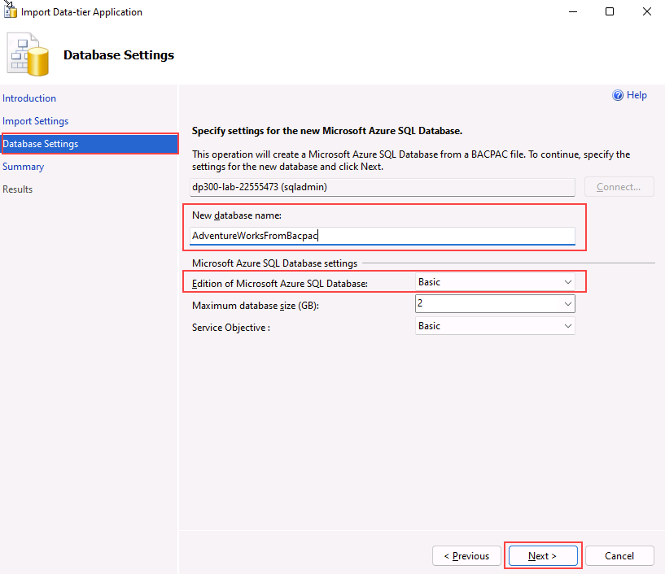
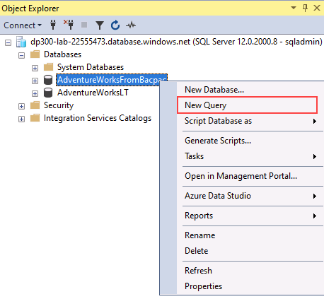

---
lab:
  title: 'Lab 4: Konfigurieren von Firewallregeln für die Azure SQL-Datenbank'
  module: Implement a Secure Environment for a Database Service
---

# Implementieren einer sicheren Umgebung

**Geschätzte Dauer: 30 Minuten**

Die Kursteilnehmer nutzen die in den Lektionen erworbenen Informationen, um die Sicherheit im Azure-Portal und in der AdventureWorks-Datenbank zu konfigurieren und anschließend zu implementieren.

Sie wurden als verantwortlicher Datenbankadministrator eingestellt, um die Sicherheit der Datenbankumgebung zu gewährleisten. Für diese Aufgaben wird schwerpunktmäßig Azure SQL-Datenbank eingesetzt.

**Hinweis:** In diesen Übungen werden Sie aufgefordert, T-SQL-Code zu kopieren und einzufügen. Überprüfen Sie, ob der Code korrekt kopiert wurde, bevor Sie ihn ausführen.

## Konfigurieren von Firewallregeln für Azure SQL-Datenbank

1. Starten Sie auf dem virtuellen Lab-Computer eine Browsersitzung, und navigieren Sie zu [https://portal.azure.com](https://portal.azure.com/). Stellen Sie eine Verbindung zum Portal her. Verwenden Sie dafür **Benutzernamen** und **Kennwort** von Azure, die auf der Registerkarte **Ressourcen** für diesen virtuellen Lab-Computer bereitgestellt werden.

    

1. Suchen Sie im Azure-Portal über die Suchleiste oben nach „SQL-Server“, und wählen Sie aus der Optionsliste **SQL-Server** aus.

    

1. Wählen Sie den Servernamen **dp300-lab-XXXXXXXX** aus, um zur Detailseite zu gelangen. (Möglicherweise ist Ihrem SQL Server eine andere Ressourcengruppe und ein anderer Speicherort zugewiesen.)

    

1. Zeigen Sie auf dem Detailbildschirm für Ihre SQL Server-Instanz mit dem Cursor auf die rechte Seite des Servernamens, und klicken Sie wie unten gezeigt auf die Schaltfläche **In Zwischenablage kopieren**.

    

1. Wählen Sie **Netzwerkeinstellungen anzeigen** aus.

    

1. Klicken Sie auf der Seite **Netzwerk** auf **+ Ihre Client-IPv4-Adresse (Ihre IP-Adresse) hinzufügen** und **Speichern**.

    

    **Hinweis:** Ihre Client-IP-Adresse wurde automatisch für Sie eingegeben. Wenn Sie Ihre Client-IP-Adresse zur Liste hinzufügen, können Sie mit SQL Server Management Studio oder anderen Client-Tools eine Verbindung zu Ihrer Azure SQL-Datenbank herstellen. **Notieren Sie sich die Client-IP-Adresse, denn Sie wird im Verlauf dieser Übung benötigt.**

1. Öffnen Sie SQL Server Management Studio. Fügen Sie im Dialogfeld „Mit Server verbinden“ den Namen Ihres Azure SQL-Datenbank-Servers ein, und melden Sie sich mit den folgenden Anmeldeinformationen an:

    - **Servername:** &lt;_Namen des Azure SQL-Datenbankservers hier einfügen_&gt;
    - **Authentifizierung:** SQL Server-Authentifizierung
    - **Serveradministratoranmeldung:** sqladmin
    - **Kennwort**: P@ssw0rd01

    

1. Klicken Sie auf **Verbinden**.

1. Erweitern Sie im Objekt-Explorer den Serverknoten, und klicken Sie mit der rechten Maustaste auf **Datenbanken**. Klicken Sie auf **Datenschichtanwendung importieren**.

    

1. Klicken Sie im Dialogfeld **Datenschichtanwendung importieren** im ersten Bildschirm auf **Weiter**.

1. Laden Sie die .bacpac-Datei von **https://github.com/MicrosoftLearning/dp-300-database-administrator/blob/master/Instructions/Templates/AdventureWorksLT.bacpac** in den Pfad **C:\LabFiles\Secure Environment** auf dem virtuellen Lab-Computer herunter. (Erstellen Sie die Ordnerstruktur, falls sie nicht vorhanden ist.)

1. Klicken Sie auf dem Bildschirm „**Einstellungen importieren“** auf **Durchsuchen**, navigieren Sie zum Ordner **D:\Labfiles\Secure Environment**, wählen Sie die Datei **AdventureWorksLT.bacpac** aus, und klicken Sie auf **Öffnen**. Klicken Sie wieder im Bildschirm **Datenebene importieren** auf **Weiter**.

    

    

1. Nehmen Sie auf der Anzeige **Datenbankeinstellungen** die folgenden Änderungen vor:

    - **Datenbankname:** AdventureWorksFromBacpac
    - **Edition von Microsoft Azure SQL-Datenbank**: Basic

    

1. Klicken Sie auf **Weiter**.

1. Klicken Sie auf dem Bildschirm **Zusammenfassung** auf **Fertig stellen**. Nachdem der Import abgeschlossen ist, werden die unten aufgeführten Ergebnisse angezeigt. Klicken Sie dann auf **Schließen**.

    

1. Erweitern Sie im **Objekt-Explorer** von SQL Server Management Studio den Ordner **Datenbanken**. Klicken Sie anschließend mit der rechten Maustaste auf die Datenbank **AdventureWorksFromBacpac**, und wählen Sie **Neue Abfrage** aus.

    

1. Führen Sie die folgende T-SQL-Abfrage aus, indem Sie den Text in das Abfragefenster einfügen.
    1. **Wichtig:** Ersetzen Sie **000.000.000.00** durch Ihre Client-IP-Adresse. Klicken Sie auf **Ausführen** oder drücken Sie **F5**.

    ```sql
    EXECUTE sp_set_database_firewall_rule 
            @name = N'AWFirewallRule',
            @start_ip_address = '000.000.000.00', 
            @end_ip_address = '000.000.000.00'
    ```

1. Als Nächstes erstellen Sie in der Datenbank **AdventureWorksFromBacpac** einen eingeschränkten Benutzer. Klicken Sie auf **Neue Abfrage**, und führen Sie den folgenden T-SQL-Code aus.

    ```sql
    USE [AdventureWorksFromBacpac]
    GO
    CREATE USER ContainedDemo WITH PASSWORD = 'P@ssw0rd01'
    ```

    

    **Hinweis**: Dieser Befehl erstellt einen eingeschränkten Benutzer in der Datenbank **AdventureWorksFromBacpac**. Im nächsten Schritt testen wir diese Anmeldeinformationen.

1. Navigieren Sie zum **Objekt-Explorer**. Klicken Sie auf **Verbinden**, und **Datenbank-Engine**.

    

1. Versuchen Sie, mit den im vorherigen Schritt erstellten Anmeldeinformationen eine Verbindung herzustellen. Verwenden Sie die folgenden Informationen:

    - **Anmeldename:** containeddemo
    - **Kennwort**: P@ssw0rd01

     Klicken Sie auf **Verbinden**.

     Sie erhalten die folgende Fehlermeldung:

    

    **Hinweis:** Dieser Fehler wird erzeugt, weil die Verbindung versucht hat, sich bei der *Master-Datenbank* anzumelden und nicht bei **AdventureWorksFromBacpac**, wo der Benutzer erstellt wurde. Ändern Sie den Verbindungskontext. Klicken Sie dafür auf **OK**, um die Fehlermeldung zu beenden, und dann im Dialogfeld **Mit Server verbinden** auf **Optionen**, wie unten gezeigt.

    

1. Geben Sie auf der Registerkarte **Verbindungseigenschaften** den Datenbanknamen **AdventureWorksFromBacpac** ein, und klicken Sie dann auf **Verbinden**.

    

1. Beachten Sie, dass Sie sich erfolgreich mit dem Benutzer **ContainedDemo** authentifizieren konnten. Dieses Mal waren Sie direkt bei **AdventureWorksFromBacpac** angemeldet, der einzigen Datenbank, auf die der neu angelegte Benutzer Zugriff hat.

    

In dieser Übung haben Sie Firewallregeln für Server und Datenbank für den Zugriff auf eine auf Azure SQL Database gehostete Datenbank konfiguriert. Außerdem haben Sie mit T-SQL-Anweisungen einen eingeschränkten Benutzer erstellt und in SQL Server Management Studio den Zugriff überprüft.
