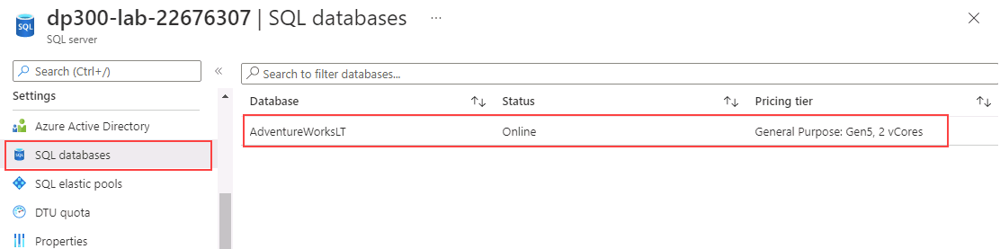
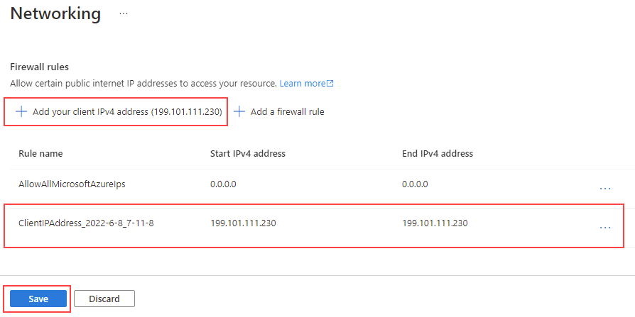

---
lab:
  title: 'Lab 6: Isolieren von Leistungsproblemen durch Überwachung'
  module: Monitor and optimize operational resources in Azure SQL
---

# Isolieren von Leistungsproblemen durch Überwachung

**Geschätzte Dauer: 30 Minuten**

Die Kursteilnehmer planen anhand der in den Lektionen gewonnenen Informationen die Leistungen für ein digitales Transformationsprojekt in AdventureWorks. Sie untersuchen das Azure-Portal und andere Tools und bestimmen, wie sie Tools zur Identifizierung und Lösung von Leistungsproblemen einsetzen können.

Sie wurden als Datenbankadministrator eingestellt, um leistungsbezogene Probleme zu ermitteln und geeignete Lösungen zu erarbeiten, um gefundene Probleme zu beheben. Sie müssen das Azure-Portal verwenden, um die Leistungsprobleme zu identifizieren, und Methoden vorschlagen, um diese zu beheben.

**Hinweis:** Diese Übungen bitten Sie, T-SQL-Code zu kopieren und einzufügen, und verwenden vorhandene SQL-Ressourcen. Überprüfen Sie, ob der Code korrekt kopiert wurde, bevor Sie ihn ausführen.

## Überprüfen der CPU-Auslastung im Azure-Portal

1. Starten Sie auf dem virtuellen Lab-Computer eine Browsersitzung, und navigieren Sie zu [https://portal.azure.com](https://portal.azure.com/). Stellen Sie eine Verbindung zum Portal her. Verwenden Sie dafür **Benutzernamen** und **Kennwort** von Azure, die auf der Registerkarte **Ressourcen** für diesen virtuellen Lab-Computer bereitgestellt werden.

    

1. Suchen Sie im Azure-Portal über die Suchleiste oben nach „SQL-Server“, und wählen Sie aus der Optionsliste **SQL-Server** aus.

    

1. Wählen Sie den Servernamen **dp300-lab-XXXXXXXX** aus, um zur Detailseite zu gelangen. (Möglicherweise ist Ihrem SQL Server eine andere Ressourcengruppe und ein anderer Speicherort zugewiesen.)

    

1. Navigieren Sie auf dem Hauptblatt Ihres Azure SQL-Servers zum Abschnitt **Einstellungen**, wählen Sie **SQL-Datenbanken** und dann den Namen der Datenbank aus.

    

1. Wählen Sie auf der Hauptseite der Datenbank die Option **Serverfirewall festlegen** aus.

    

1. Wählen Sie auf der Seite **Netzwerk** die Option **+ Ihre Client-IPv4-Adresse (Ihre IP-Adresse) hinzufügen** und dann **Speichern** aus.

    

1. Wählen Sie in der Navigationsleiste über **Netzwerk** den Link aus, der mit **AdventureWorksLT** beginnt.

    

1. Klicken Sie in der linken Navigationsleiste auf **Abfrage-Editor (Vorschau)**.

    

    **Hinweis**: Dieses Feature befindet sich in der Vorschau.

1. Geben Sie im Feld **Kennwort** **P@ssw0rd01** ein, und wählen Sie **OK**.

    

1. Geben Sie unter **Abfrage 1** die folgende Abfrage ein, und klicken Sie auf **Ausführen**:

    ```sql
    DECLARE @Counter INT 
    SET @Counter=1
    WHILE ( @Counter <= 10000)
    BEGIN
        SELECT 
             RTRIM(a.Firstname) + ' ' + RTRIM(a.LastName)
            , b.AddressLine1
            , b.AddressLine2
            , RTRIM(b.City) + ', ' + RTRIM(b.StateProvince) + '  ' + RTRIM(b.PostalCode)
            , CountryRegion
            FROM SalesLT.Customer a
            INNER JOIN SalesLT.CustomerAddress c 
                ON a.CustomerID = c.CustomerID
            RIGHT OUTER JOIN SalesLT.Address b
                ON b.AddressID = c.AddressID
        ORDER BY a.LastName ASC
        SET @Counter  = @Counter  + 1
    END
    ```

    

1. Warten Sie, bis die Abfrage beendet ist.

1. Wählen Sie im Blade für die Datenbank **AdventureWorksLT** das Symbol **Metriken** im Abschnitt **Überwachung**.

    

1. Ändern Sie die Menüoption **Metrik** so, dass sie den **CPU-Prozentsatz** widerspiegelt, und wählen Sie dann eine **Aggregation** von **Mittelwert** aus. Dadurch wird der durchschnittliche CPU-Prozentsatz für den angegebenen Zeitrahmen angezeigt.

    

1. Beobachten Sie den CPU-Durchschnitt über einen Zeitraum hinweg. Ihre Ergebnisse können leicht abweichen. Alternativ können Sie die Abfrage auch mehrmals ausführen, um aussagekräftigere Ergebnisse zu erhalten.

    

## Ermitteln von Abfragen mit hoher CPU-Auslastung

1. Suchen Sie im Abschnitt **Intelligente Leistung** des Blatts für die **AdventureWorksLT**-Datenbank nach dem Symbol für **Query Performance Insight**.

    

1. Wählen Sie **Einstellungen zurücksetzen** aus.

    

1. Klicken Sie im Raster unterhalb des Diagramms auf die Abfrage. Wenn keine Abfrage angezeigt wird, warten Sie etwa zwei Minuten, und wählen Sie **Aktualisieren** aus.

    **Hinweis:** Bei Ihnen können Dauer und Abfrage-ID abweichen. Wenn Sie mehr als eine Abfrage sehen, klicken Sie auf jede einzelne, um die Ergebnisse zu verfolgen.

    

Für diese Abfrage können Sie sehen, dass die Gesamtdauer über eine Minute betrug und dass sie etwa 10.000 Mal ausgeführt wurde.

In dieser Übung haben Sie gelernt, wie Sie Serverressourcen für eine Azure SQL-Datenbank untersuchen und potenzielle Probleme mit der Abfrageleistung mithilfe von Query Performance Insight identifizieren können.
