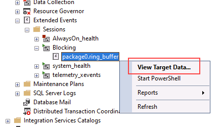

---
lab:
  title: 'Lab 8: Ermitteln und Beheben von Blockierproblemen'
  module: Optimize query performance in Azure SQL
---

# Ermitteln und Beheben von Blockierproblemen

**Geschätzte Dauer**: 15 Minuten

Die Kursteilnehmer planen anhand der in den Lektionen gewonnenen Informationen die Leistungen für ein digitales Transformationsprojekt in AdventureWorks. Sie untersuchen das Azure-Portal und andere Tools und bestimmen, wie sie native Tools zur Identifizierung und Lösung von Leistungsproblemen einsetzen können. Abschließend werden die Teilnehmer in der Lage sein, Blockierprobleme zu erkennen und angemessen zu lösen.

Sie wurden als Datenbankadministrator eingestellt, um leistungsbezogene Probleme zu ermitteln und geeignete Lösungen zu erarbeiten, um gefundene Probleme zu beheben. Sie müssen die Leistungsprobleme untersuchen und Methoden zu ihrer Behebung vorschlagen.

**Hinweis:** In diesen Übungen werden Sie aufgefordert, T-SQL-Code zu kopieren und einzufügen. Überprüfen Sie, ob der Code korrekt kopiert wurde, bevor Sie ihn ausführen.

## Wiederherstellen einer Datenbank

1. Laden Sie die Sicherungsdatei der Datenbank unter **https://github.com/MicrosoftLearning/dp-300-database-administrator/blob/master/Instructions/Templates/AdventureWorks2017.bak** in den Pfad **C:\LabFiles\Monitor and optimize** auf dem virtuellen Lab-Computer herunter. (Erstellen Sie die Ordnerstruktur, falls sie nicht vorhanden ist.)

    

1. Wählen Sie die Windows-Starttaste und geben Sie SSMS ein. Wählen Sie **Microsoft SQL Server Management Studio 18** aus der Liste aus.  

    

1. Beim Öffnen von SSMS wird das Dialogfeld **Mit Server verbinden** vorab mit dem Standardinstanznamen ausgefüllt. Wählen Sie **Verbinden**.

    

1. Wählen Sie den Ordner **Datenbanken** und dann **Neue Abfrage** aus.

    

1. Kopieren Sie im Fenster „Neue Abfrage“ den folgenden T-SQL, und fügen Sie ihn ein. Führen Sie die Abfrage aus, um die Datenbank wiederherzustellen.

    ```sql
    RESTORE DATABASE AdventureWorks2017
    FROM DISK = 'C:\LabFiles\Monitor and optimize\AdventureWorks2017.bak'
    WITH RECOVERY,
          MOVE 'AdventureWorks2017' 
            TO 'C:\LabFiles\Monitor and optimize\AdventureWorks2017.mdf',
          MOVE 'AdventureWorks2017_log'
            TO 'C:\LabFiles\Monitor and optimize\AdventureWorks2017_log.ldf';
    ```

    **Hinweis:** Der Name und der Pfad der Datenbanksicherungsdatei sollten mit der in Schritt 1 heruntergeladenen Datei übereinstimmen, andernfalls wird der Befehl fehlschlagen.

1. Nach beendeter Wiederherstellung sollte eine Erfolgsmeldung angezeigt werden.

    

## Ausführen blockierter Abfrageberichte

1. Wählen Sie **Neue Abfrage** aus. Kopieren Sie den folgenden T-SQL-Code, und fügen Sie ihn in das Abfragefenster ein. Klicken Sie auf **Ausführen**, um die Abfrage auszuführen.

    ```sql
    USE MASTER

    GO

    CREATE EVENT SESSION [Blocking] ON SERVER 
    ADD EVENT sqlserver.blocked_process_report(
    ACTION(sqlserver.client_app_name,sqlserver.client_hostname,sqlserver.database_id,sqlserver.database_name,sqlserver.nt_username,sqlserver.session_id,sqlserver.sql_text,sqlserver.username))
    ADD TARGET package0.ring_buffer
    WITH (MAX_MEMORY=4096 KB, EVENT_RETENTION_MODE=ALLOW_SINGLE_EVENT_LOSS, MAX_DISPATCH_LATENCY=30 SECONDS, MAX_EVENT_SIZE=0 KB,MEMORY_PARTITION_MODE=NONE, TRACK_CAUSALITY=OFF,STARTUP_STATE=ON)
    GO

    -- Start the event session 
    ALTER EVENT SESSION [Blocking] ON SERVER 
    STATE = start; 
    GO
    ```

    Der T-SQL-Code oben erstellt eine Sitzung für ein erweitertes Ereignis, bei dem blockierende Ereignisse erfasst werden. Die Daten beinhalten die folgenden Elemente:

    - Name der Clientanwendung
    - Clienthostname
    - Datenbank-ID
    - Datenbankname
    - NT-Benutzername
    - Sitzungs-ID
    - T-SQL-Text
    - Benutzername

1. Wählen Sie **Neue Abfrage** aus. Kopieren Sie den folgenden T-SQL-Code, und fügen Sie ihn in das Abfragefenster ein. Klicken Sie auf **Ausführen**, um die Abfrage auszuführen.

    ```sql
    EXEC sys.sp_configure N'show advanced options', 1
    RECONFIGURE WITH OVERRIDE;
    GO
    EXEC sp_configure 'blocked process threshold (s)', 60
    RECONFIGURE WITH OVERRIDE;
    GO
    ```

    **Hinweis:** Der obige Befehl gibt den Schwellenwert in Sekunden an, nach dem Berichte zu blockierten Prozesse erstellt werden. Daher müssen wir in dieser Lektion nicht so lange warten, bis der *blocked_process_report* ausgelöst wird.

1. Wählen Sie **Neue Abfrage** aus. Kopieren Sie den folgenden T-SQL-Code, und fügen Sie ihn in das Abfragefenster ein. Klicken Sie auf **Ausführen**, um die Abfrage auszuführen.

    ```sql
    USE AdventureWorks2017
    GO

    BEGIN TRANSACTION
        UPDATE Person.Person 
        SET LastName = LastName;

    GO
    ```

1. Öffnen Sie ein weiteres Abfragefenster, indem Sie auf die Schaltfläche **Neue Abfrage** klicken. Kopieren Sie den folgenden T-SQL-Code, und fügen Sie ihn in das neue Abfragefenster ein. Klicken Sie auf **Ausführen**, um die Abfrage auszuführen.

    ```sql
    USE AdventureWorks2017
    GO

    SELECT TOP (1000) [LastName]
      ,[FirstName]
      ,[Title]
    FROM Person.Person
    WHERE FirstName = 'David'
    ```

    **Hinweis:** Diese Abfrage gibt keine Ergebnisse zurück und scheint unbegrenzt zu laufen.

1. Erweitern Sie im **Objekt-Explorer** die Optionen **Verwaltung** -> **Erweiterte Ereignisse** -> **Sitzungen**.

    Beachten Sie, dass das soeben erstellte erweiterte Ereignis *Blockieren* in der Liste enthalten ist.

    

1. Klicken Sie mit der rechten Maustaste auf **package0.ring_buffer**, und klicken Sie auf **Zieldaten anzeigen**.

    

1. Klicken Sie auf den Link.

    

1. Die XML-Datei zeigt Ihnen, welche Prozesse blockiert werden und welcher Prozess die Blockierung verursacht. Sie können die Abfragen sehen, die in diesem Prozess ausgeführt wurden, sowie Systeminformationen.

    

1. Alternativ können Sie die unten stehende Abfrage ausführen, um Sitzungen zu identifizieren, die andere Sitzungen blockieren, einschließlich einer Liste der Sitzungs-IDs, die pro *Sitzungs-ID* blockiert werden.

    ```sql
    WITH cteBL (session_id, blocking_these) AS 
    (SELECT s.session_id, blocking_these = x.blocking_these FROM sys.dm_exec_sessions s 
    CROSS APPLY    (SELECT isnull(convert(varchar(6), er.session_id),'') + ', '  
                    FROM sys.dm_exec_requests as er
                    WHERE er.blocking_session_id = isnull(s.session_id ,0)
                    AND er.blocking_session_id <> 0
                    FOR XML PATH('') ) AS x (blocking_these)
    )
    SELECT s.session_id, blocked_by = r.blocking_session_id, bl.blocking_these
    , batch_text = t.text, input_buffer = ib.event_info, * 
    FROM sys.dm_exec_sessions s 
    LEFT OUTER JOIN sys.dm_exec_requests r on r.session_id = s.session_id
    INNER JOIN cteBL as bl on s.session_id = bl.session_id
    OUTER APPLY sys.dm_exec_sql_text (r.sql_handle) t
    OUTER APPLY sys.dm_exec_input_buffer(s.session_id, NULL) AS ib
    WHERE blocking_these is not null or r.blocking_session_id > 0
    ORDER BY len(bl.blocking_these) desc, r.blocking_session_id desc, r.session_id;
    ```

    

1. Klicken Sie mit der rechten Maustaste auf das erweiterte Ereignis mit dem Namen **Blockieren**, und wählen Sie dann **Sitzung beenden** aus.

    

1. Navigieren Sie zurück zu der Abfragesitzung, die die Blockierung verursacht, und geben Sie `ROLLBACK TRANSACTION` in der Zeile unter der Abfrage ein. Markieren Sie die Option `ROLLBACK TRANSACTION`, und wählen Sie **Ausführen** aus.

    

1. Navigieren Sie zurück zur Abfragesitzung, die blockiert wurde. Sie werden feststellen, dass die Abfrage nun abgeschlossen wurde.

    

## Aktivieren der Momentaufnahme-Isolationsstufe „READ COMMITTED“

1. Klicken Sie in SQL Server Management Studio auf **Neue Abfrage**. Kopieren Sie den folgenden T-SQL-Code, und fügen Sie ihn in das Abfragefenster ein. Klicken Sie auf die Schaltfläche **Ausführen**, um diese Abfrage auszuführen.

    ```sql
    USE master
    GO
    
    ALTER DATABASE AdventureWorks2017 SET READ_COMMITTED_SNAPSHOT ON WITH ROLLBACK IMMEDIATE;
    GO
    ```

1. Führen Sie die Abfrage, die die Blockierung verursacht hat, in einem neuen Abfrage-Editor erneut aus.

    ```sql
    USE AdventureWorks2017
    GO
    
    BEGIN TRANSACTION
        UPDATE Person.Person 
        SET LastName = LastName;
    GO
    ```

1. Führen Sie die Abfrage, die blockiert wurde, in einem neuen Abfrage-Editor erneut aus.

    ```sql
    USE AdventureWorks2017
    GO
    
    SELECT TOP (1000) [LastName]
     ,[FirstName]
     ,[Title]
    FROM Person.Person
    WHERE firstname = 'David'
    ```

    

    Warum wird dieselbe Abfrage abgeschlossen, während sie in der vorherigen Aufgabe durch die Aktualisierungsanweisung blockiert wurde?

    Die Isolationsebene Read Commit Snapshot ist eine optimistische Form der Transaktionsisolation, und die letzte Abfrage zeigt die letzte festgeschriebene Version der Daten, anstatt blockiert zu werden.

In dieser Übung haben Sie gelernt, wie Sie blockierte Sitzungen identifizieren und solche Szenarien entschärfen können.
