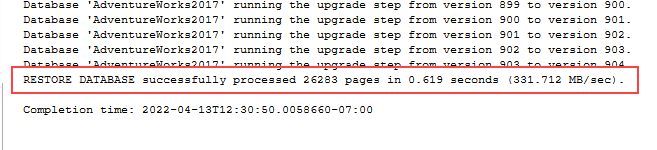
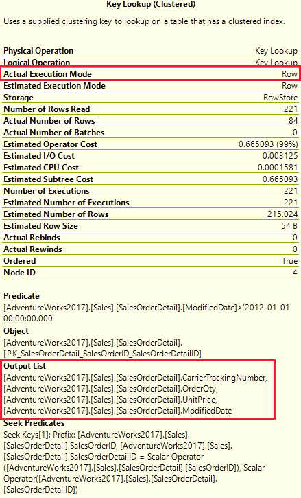
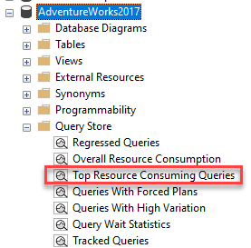
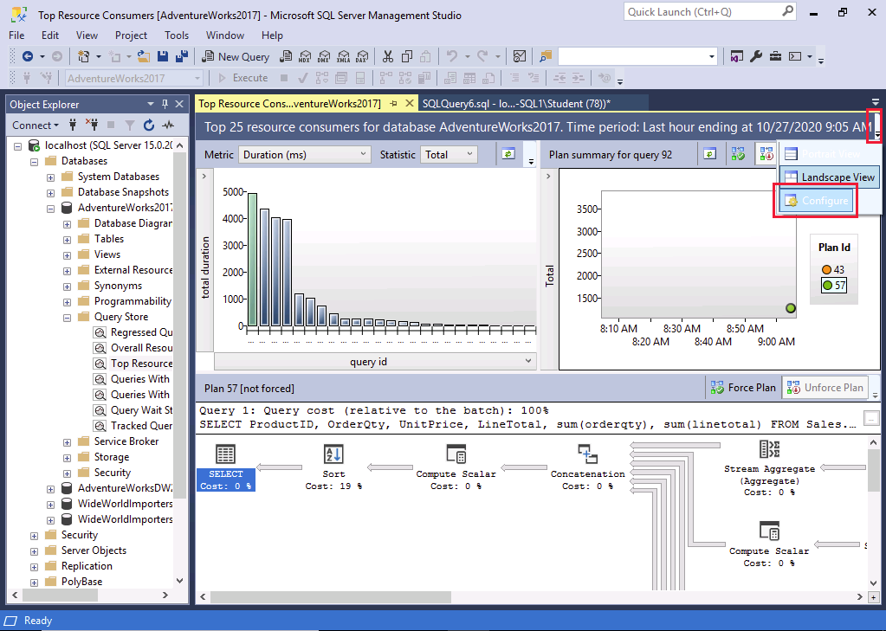
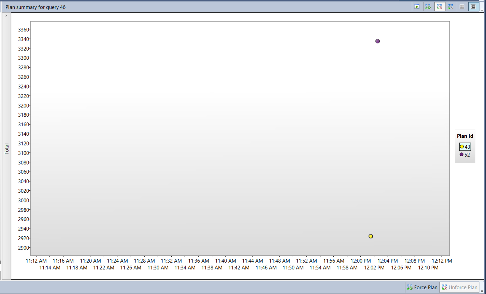

---
lab:
  title: 'Lab 10: Isolieren von Problembereichen in Abfragen mit schlechter Leistung in SQL-Datenbank'
  module: Optimize query performance in Azure SQL
---

# Isolieren von Problembereichen in Abfragen mit schlechter Leistung in SQL-Datenbank

**Geschätzte Dauer: 30 Minuten**

Sie wurden als leitender Datenbankadministrator eingestellt, um Leistungsprobleme zu beheben, die derzeit auftreten, wenn Benutzer die Datenbank *AdventureWorks2017* abfragen. Ihre Aufgabe besteht darin, Probleme bei der Abfrageleistung zu identifizieren und diese mithilfe der in diesem Modul erlernten Methoden zu beheben.

Sie werden Abfragen mit suboptimaler Leistung ausführen, die Abfragepläne untersuchen und versuchen, Verbesserungen an der Datenbank vorzunehmen.

**Hinweis:** In diesen Übungen werden Sie aufgefordert, T-SQL-Code zu kopieren und einzufügen. Überprüfen Sie, ob der Code korrekt kopiert wurde, bevor Sie ihn ausführen.

## Wiederherstellen einer Datenbank

1. Laden Sie die Sicherungsdatei der Datenbank unter **https://github.com/MicrosoftLearning/dp-300-database-administrator/blob/master/Instructions/Templates/AdventureWorks2017.bak** in den Pfad **C:\LabFiles\Monitor and optimize** auf dem virtuellen Lab-Computer herunter. (Erstellen Sie die Ordnerstruktur, falls sie nicht vorhanden ist.)

    

1. Wählen Sie die Windows-Starttaste und geben Sie SSMS ein. Wählen Sie **Microsoft SQL Server Management Studio 18** aus der Liste aus.  

    

1. Beim Öffnen von SSMS wird das Dialogfeld **Mit Server verbinden** vorab mit dem Standardinstanznamen ausgefüllt. Wählen Sie **Verbinden**.

    

1. Wählen Sie den Ordner **Datenbanken** und dann **Neue Abfrage** aus.

    

1. Kopieren Sie im Fenster „Neue Abfrage“ den folgenden T-SQL, und fügen Sie ihn ein. Führen Sie die Abfrage aus, um die Datenbank wiederherzustellen.

    ```sql
    RESTORE DATABASE AdventureWorks2017
    FROM DISK = 'C:\LabFiles\Monitor and optimize\AdventureWorks2017.bak'
    WITH RECOVERY,
          MOVE 'AdventureWorks2017' 
            TO 'C:\LabFiles\Monitor and optimize\AdventureWorks2017.mdf',
          MOVE 'AdventureWorks2017_log'
            TO 'C:\LabFiles\Monitor and optimize\AdventureWorks2017_log.ldf';
    ```

    **Hinweis:** Der Name und der Pfad der Datenbanksicherungsdatei sollten mit der in Schritt 1 heruntergeladenen Datei übereinstimmen, andernfalls wird der Befehl fehlschlagen.

1. Nach beendeter Wiederherstellung sollte eine Erfolgsmeldung angezeigt werden.

    

## Generieren des tatsächlichen Ausführungsplans

Es gibt mehrere Möglichkeiten, einen Ausführungsplan in SQL Server Management Studio zu generieren.

1. Wählen Sie **Neue Abfrage** aus. Kopieren Sie den folgenden T-SQL-Code, und fügen Sie ihn in das Abfragefenster ein. Klicken Sie auf **Ausführen**, um die Abfrage auszuführen.

    **Hinweis:** Verwenden Sie **SHOWPLAN_ALL**, um eine Textversion des Ausführungsplans einer Abfrage im Ergebnisbereich statt grafisch in einer separaten Registerkarte anzuzeigen.

    ```sql
    USE AdventureWorks2017;
    GO

    SET SHOWPLAN_ALL ON;
    GO

    SELECT BusinessEntityID
    FROM HumanResources.Employee
    WHERE NationalIDNumber = '14417807';
    GO

    SET SHOWPLAN_ALL OFF;
    GO
    ```

    Sie sehen eine Textversion des Ausführungsplans anstelle der tatsächlichen Ergebnisse der **SELECT**-Anweisung.

    

1. Nehmen Sie sich einen Moment Zeit, um den Text in der zweiten Zeile der Spalte **StmtText** zu untersuchen:

    ```console
    |--Index Seek(OBJECT:([AdventureWorks2017].[HumanResources].[Employee].[AK_Employee_NationalIDNumber]), SEEK:([AdventureWorks2017].[HumanResources].[Employee].[NationalIDNumber]=CONVERT_IMPLICIT(nvarchar(4000),[@1],0)) ORDERED FORWARD)
    ```

    Der obige Text erläutert, dass der Ausführungsplan eine **Indexsuche** nach dem Schlüssel **AK_Employee_NationalIDNumber** verwendet. Es zeigt auch, dass der Ausführungsplan einen **CONVERT_IMPLICIT**-Schritt durchführen musste.

    Der Abfrageoptimierer konnte einen geeigneten Index finden, um die erforderlichen Datensätze abzurufen.

## Korrigieren eines suboptimalen Abfrageplans

1. Kopieren Sie den folgenden Code, und fügen Sie ihn in ein neues Abfragefenster ein.

    Klicken Sie auf das Symbol **Tatsächlichen Ausführungsplan einschließen** (wie in der Abbildung unten dargestellt), bevor Sie die Abfrage ausführen, oder drücken Sie <kbd>STRG</kbd>+<kbd>M</kbd>. Führen Sie die Abfrage aus, indem Sie auf **Ausführen** klicken oder <kbd>F5</kbd> drücken. Beachten Sie den Ausführungsplan und die logischen Lesevorgänge auf der Registerkarte „Nachrichten“.

    ```sql
    SET STATISTICS IO, TIME ON;

    SELECT [SalesOrderID] ,[CarrierTrackingNumber] ,[OrderQty] ,[ProductID], [UnitPrice] ,[ModifiedDate]
    FROM [AdventureWorks2017].[Sales].[SalesOrderDetail]
    WHERE [ModifiedDate] > '2012/01/01' AND [ProductID] = 772;
    ```

    

    Wenn Sie den Ausführungsplan überprüfen, werden Sie feststellen, dass ein **Schlüssellookup** vorgesehen ist. Wenn Sie mit der Maus auf das Symbol zeigen, werden Sie sehen, dass das Lookup laut den Eigenschaften für jede von der Abfrage abgerufene Zeile ausgeführt wird. Es wird angezeigt, dass der Ausführungsplan ein **Schlüssellookup** ausführt.

    

    Notieren Sie sich die Spalten im **Abschnitt Ausgabeliste**. Wie würden Sie diese Abfrage verbessern?

    Wenn Sie ermitteln möchten, welcher Index geändert werden muss, um das Schlüssellookup zu entfernen, müssen Sie den übergeordneten Index prüfen. Zeigen Sie mit dem Mauszeiger auf den Index Seek-Operator. Daraufhin werden die Eigenschaften des Operators angezeigt.

    

1. **Schlüssellookups** können durch Hinzufügen eines umfassenden Indexes entfernt werden, der alle Felder enthält, die in der Abfrage zurückgegeben oder durchsucht werden. In diesem Beispiel verwendet der Index nur die Spalte **ProductID**. Korrigieren Sie das **Schlüssellookup**, und führen Sie die Abfrage noch einmal aus, um den neuen Plan anzuzeigen.

    ```sql
    CREATE NONCLUSTERED INDEX [IX_SalesOrderDetail_ProductID] ON [Sales].[SalesOrderDetail]
    ([ProductID] ASC)
    ```

    Wenn Sie die **Output List**-Felder als eingeschlossene Spalten zum Index hinzufügen, wird der **Key Lookup** entfernt. Da der Index bereits vorhanden ist, müssen Sie entweder den Index per DROP-Anweisung löschen und neu erstellen oder **DROP_EXISTING=ON** konfigurieren, um die Spalten hinzuzufügen. Beachten Sie, dass die Spalte **ProductID** bereits zum Index gehört und nicht als enthaltene Spalte hinzugefügt werden muss. Es gibt eine weitere Leistungsverbesserung, die Sie durch Hinzufügen von **ModifiedDate** am Index vornehmen können.

    ```sql
    CREATE NONCLUSTERED INDEX [IX_SalesOrderDetail_ProductID]
    ON [Sales].[SalesOrderDetail] ([ProductID],[ModifiedDate])
    INCLUDE ([CarrierTrackingNumber],[OrderQty],[UnitPrice])
    WITH (DROP_EXISTING = on);
    GO
    ```

1. Führen Sie die Abfrage aus Schritt 1 noch einmal aus. Beachten Sie die Änderungen an den logischen Lesevorgängen und am Ausführungsplan. Der Plan muss nun nur noch den von uns erstellten nicht gruppierten Index verwenden.

    

## Verwenden des Abfragespeichers zum Erkennen und Beheben von Regressionen

Als Nächstes führen Sie eine Workload aus, um Abfragestatistiken für den Abfragespeicher zu erstellen, prüfen den Bericht zu den **Abfragen mit dem höchsten Ressourcenverbrauch**, um schlechte Leistung zu identifizieren, und sehen, wie Sie einen besseren Ausführungsplan erzwingen können.

1. Wählen Sie **Neue Abfrage** aus. Kopieren Sie den folgenden T-SQL-Code, und fügen Sie ihn in das Abfragefenster ein. Klicken Sie auf **Ausführen**, um die Abfrage auszuführen.

    Mit diesem Skript wird der Abfragespeicher für AdventureWorks2017 aktiviert und die Datenbank auf den Kompatibilitätsgrad 100 festgelegt.

    ```sql
    USE [master];
    GO

    ALTER DATABASE [AdventureWorks2017] SET QUERY_STORE = ON;
    GO

    ALTER DATABASE [AdventureWorks2017] SET QUERY_STORE (OPERATION_MODE = READ_WRITE);
    GO

    ALTER DATABASE [AdventureWorks2017] SET COMPATIBILITY_LEVEL = 100;
    GO
    ```

    Wenn Sie den Kompatibilitätsgrad ändern, kommt dies einer Reise in die Vergangenheit gleich. Denn durch diese Aktion werden die Features von SQL Server auf die Features beschränkt, die in SQL Server 2008 verfügbar waren.

1. Laden Sie das T-SQL-Skript unter **https://github.com/MicrosoftLearning/dp-300-database-administrator/blob/master/Instructions/Templates/CreateRandomWorkloadGenerator.sql** in den Pfad **C:\LabFiles\Monitor and optimize** auf dem virtuellen Lab-Computer herunter.

1. Laden Sie das T-SQL-Skript unter **https://github.com/MicrosoftLearning/dp-300-database-administrator/blob/master/Instructions/Templates/ExecuteRandomWorkload.sql** in den Pfad **C:\LabFiles\Monitor and optimize** auf dem virtuellen Lab-Computer herunter.

1. Klicken Sie in SQL Server Management Studio auf **Datei** > **Öffnen** > **Datei**.

1. Navigieren Sie zur Datei **C:\LabFiles\Monitor and optimize\CreateRandomWorkloadGenerator.sql**.

1. Nachdem Sie sie in SQL Server Management Studio geöffnet haben, wählen Sie **Ausführen** oder drücken Sie <kbd>F5</kbd>, um die Abfrage auszuführen.

1. Öffnen Sie die Datei **C:\LabFiles\Monitor and optimize\ExecuteRandomWorkload.sql** in einem neuen Abfrageeditor, und wählen Sie **Ausführen**, oder drücken Sie <kbd>F5</kbd>, um die Abfrage auszuführen.

1. Führen Sie das Skript ein zweites Mal aus, nachdem die Ausführung abgeschlossen wurde, um zusätzliche Last auf dem Server zu erzeugen. Lassen Sie die Abfrageregisterkarte für diese Abfrage geöffnet.

1. Kopieren Sie den folgenden Code, und fügen Sie ihn in ein neues Abfragefenster ein. Führen Sie ihn dann aus, indem Sie auf **Ausführen** klicken oder <kbd>F5</kbd> drücken. 

    Dieses Skript ändert den Kompatibilitätsmodus der Datenbank in SQL Server 2019 (**150**). Alle Funktionen und Verbesserungen seit SQL Server 2008 sind nun für die Datenbank verfügbar.

    ```sql
    USE [master];
    GO

    ALTER DATABASE [AdventureWorks2017] SET COMPATIBILITY_LEVEL = 150;
    GO
    ```

1. Navigieren Sie zurück zur Abfrageregisterkarte aus der Datei **ExecuteRandomWorkload.sql**, und führen Sie sie erneut aus.

## Untersuchen des Berichts zu den Abfragen mit dem höchsten Ressourcenverbrauch

1. Wenn Sie den Knoten „Abfragespeicher“ anzeigen möchten, müssen Sie die Datenbank „AdventureWorks2017“ in SQL Server Management Studio aktualisieren. Klicken Sie mit der rechten Maustaste auf den Datenbanknamen, und wählen Sie **Aktualisieren** aus. Daraufhin wird der Knoten „Abfragespeicher“ unter der Datenbank angezeigt.

    

1. Erweitern Sie den Knoten **Abfragespeicher**, um alle verfügbaren Berichte anzuzeigen. Wählen Sie den Bericht zu den **Abfragen mit dem höchsten Ressourcenverbrauch** aus.

    

1. Der Bericht wird wie unten gezeigt geöffnet. Klicken Sie rechts auf das Dropdownmenü, und wählen Sie **Konfigurieren** aus.

    

1. Ändern Sie auf dem Konfigurationsbildschirm den Filter für die Mindestanzahl von Abfrageplänen in 2. Wählen Sie dann **OK** aus.

    

1. Wählen Sie die Abfrage mit der längsten Ausführungsdauer aus, indem Sie im Balkendiagramm oben im Bericht den ganz linken Balken auswählen.

    

    Damit wird die Abfrage- und Planübersicht für die Abfrage mit der längsten Dauer in Ihrem Abfragespeicher angezeigt.

## Erzwingen eines besseren Ausführungsplans

1. Navigieren Sie, wie unten gezeigt, zum Bereich mit der Planzusammenfassung des Berichts. Sie werden feststellen, dass er zwei Ausführungspläne mit einer sehr unterschiedlichen Dauer enthält.

    

1. Wählen Sie im oberen rechten Fenster des Berichts die Plan-ID mit der niedrigsten Dauer aus (diese wird durch eine niedrigere Position auf der y-Achse des Diagramms angezeigt). In der obigen Abbildung ist dies *PlanID 43*. Wählen Sie die Plan-ID neben dem Planübersichtsdiagramm aus (wie im obigen Screenshot gezeigt).

1. Klicken Sie unter dem Zusammenfassungsdiagramm auf **Plan erzwingen**. Wählen Sie im eingeblendeten Bestätigungsfenster **Ja** aus.

    

    Sobald der Plan erzwungen wurde, sehen Sie, dass das Feld **Erzwungener Plan** jetzt ausgegraut ist und der Plan im Planübersichtsfenster ein Häkchen hat, das anzeigt, dass er erzwungen wurde.

    Es kann vorkommen, dass der Abfrageoptimierer eine schlechte Wahl in Bezug auf den zu verwendenden Ausführungsplan trifft. Wenn dies der Fall ist, können Sie SQL Server zwingen, Ihren gewünschten Plan zu verwenden, wenn Sie wissen, dass dieser besser funktioniert.

## Verwenden von Abfragehinweisen zum Beeinflussen der Leistung

Als Nächstes führen Sie einen Workload aus, ändern die Abfrage, um einen Parameter zu verwenden, wenden einen Abfragehinweis auf die Abfrage an und führen sie erneut aus.

Bevor Sie mit der Übung fortfahren, sollten Sie alle aktuellen Abfragefenster schließen, indem Sie im Menü **Fenster** auf **Close All Documents** (Alle Dokumente schließen) klicken. Klicken Sie im Popupfenster auf **Nein**.

1. Klicken Sie auf **Neue Abfrage** und dann auf das Symbol **Tatsächlichen Ausführungsplan einschließen**, bevor Sie die Abfrage ausführen, oder drücken Sie <kbd>STRG</kbd>+<kbd>M</kbd>.

    

1. Führen Sie folgende Abfrage aus. Beachten Sie, dass der Ausführungsplan einen Index Seek-Operator enthält.

    ```sql
    USE AdventureWorks2017;
    GO

    SELECT SalesOrderId, OrderDate
    FROM Sales.SalesOrderHeader
    WHERE SalesPersonID=288;
    ```

    

1. Führen Sie in einem neuen Abfragefenster die nächste Abfrage aus. Vergleichen von Ausführungsplänen

    ```sql
    USE AdventureWorks2017;
    GO

    SELECT SalesOrderId, OrderDate
    FROM Sales.SalesOrderHeader
    WHERE SalesPersonID=277;
    ```

    Die einzige Änderung besteht dieses Mal darin, dass der Wert für SalesPersonID auf 277 festgelegt wurde. Beachten Sie den Vorgang „Clustered Index Scan“ (Überprüfung des gruppierten Indexes) im Ausführungsplan.

    

Wie Sie sehen, hat der Abfrageoptimierer auf der Grundlage der Indexstatistiken aufgrund der unterschiedlichen Werte in der `WHERE`-Klausel einen anderen Ausführungsplan gewählt.

Warum haben Sie unterschiedliche Pläne, wenn Sie nur den Wert *SalesPersonID* geändert haben?

Da diese Abfrage in der `WHERE`-Klausel eine Konstante verwendet, betrachtet der Optimierer jede dieser Abfragen als eindeutig und generiert jedes Mal einen anderen Ausführungsplan.

## Ändern der Abfrage für die Verwendung einer Variablen und eines Abfragehinweises

1. Ändern Sie die Abfrage, sodass sie einen Variablenwert für SalesPersonID verwendet.

1. Deklarieren Sie <strong>@SalesPersonID</strong> mithilfe der T-SQL-Anweisung **DECLARE**, damit Sie einen Wert übergeben können, anstatt den Wert in der **WHERE**-Klausel hartcodieren zu müssen. Stellen Sie sicher, dass der Datentyp Ihrer Variablen mit dem Datentyp der Spalte in der Zieltabelle übereinstimmt, um eine implizite Konvertierung zu vermeiden.

    ```sql
    USE AdventureWorks2017;
    GO

    SET STATISTICS IO, TIME ON;

    DECLARE @SalesPersonID INT;

    SELECT @SalesPersonID = 288;

    SELECT SalesOrderId, OrderDate
    FROM Sales.SalesOrderHeader
    WHERE SalesPersonID= @SalesPersonID;
    ```

    Wenn Sie sich den Ausführungsplan ansehen, werden Sie feststellen, dass er eine Indexsuche verwendet, um die Ergebnisse zu erhalten. Der Abfrageoptimierer konnte keine guten Optimierungen vornehmen, da er den Wert der lokalen Variablen erst zur Laufzeit kennen kann.

1. Sie können dem Abfrageoptimierer helfen, bessere Entscheidungen zu treffen, indem Sie einen Abfragehinweis bereitstellen. Wiederholen Sie die obige Abfrage mit `OPTION (RECOMPILE)`:

    ```sql
    USE AdventureWorks2017
    GO

    SET STATISTICS IO, TIME ON;

    DECLARE @SalesPersonID INT;

    SELECT @SalesPersonID = 288;

    SELECT SalesOrderId, OrderDate
    FROM Sales.SalesOrderHeader
    WHERE SalesPersonID= @SalesPersonID
    OPTION (RECOMPILE);
    ```

    Beachten Sie, dass der Abfrageoptimierer einen effizienteren Ausführungsplan auswählen konnte. Die Option `RECOMPILE` bewirkt, dass der Abfragecompiler die Variable durch ihren Wert ersetzt.

    Wenn Sie die Statistiken vergleichen, können Sie auf der Registerkarte „Nachricht“ sehen, dass der Unterschied zwischen den logischen Lesevorgängen bei der Abfrage ohne den Abfragehinweis **68 %** größer ist (689 gegenüber 409).

In dieser Übung haben Sie gelernt, wie man Abfrageprobleme identifiziert und wie man sie behebt, um den Abfrageplan zu verbessern.
