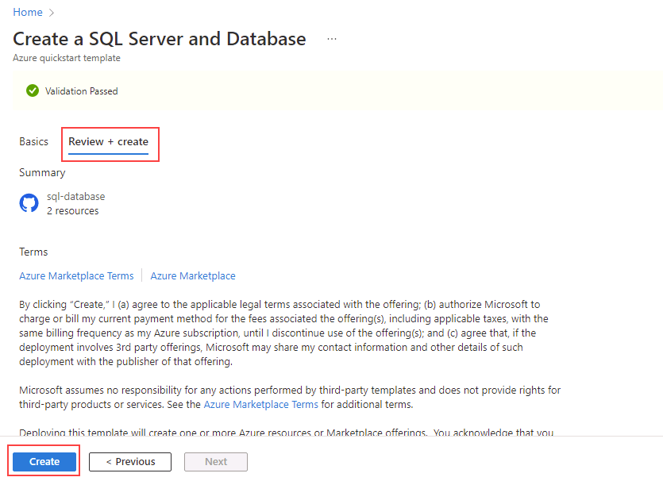

---
lab:
  title: 'Lab 11: Bereitstellen einer Azure SQL-Datenbank-Instanz mithilfe einer Azure Resource Manager-Vorlage'
  module: Automate database tasks for Azure SQL
---

# Bereitstellen einer Azure SQL-Datenbank aus einer Vorlage

**Geschätzte Dauer**: 15 Minuten

Sie wurden als Senior Data Engineer eingestellt, um das Unternehmen dabei zu unterstützen, alltägliche Vorgänge der Datenbankverwaltung zu automatisieren. Diese Automatisierung soll sicherstellen, dass die Datenbanken für AdventureWorks weiterhin mit maximaler Leistung betrieben werden und Methoden für die Alarmierung auf der Grundlage bestimmter Kriterien bereitstellen. AdventureWorks nutzt SQL Server in Angeboten mit Infrastructure-as-a-Service (IaaS) und Platform-as-a-Service (PaaS).

## Erkunden der Azure Resource Manager-Vorlage

1. Öffnen Sie in Microsoft Edge eine neue Registerkarte, und navigieren Sie zum folgenden Pfad in einem GitHub-Repository, das eine ARM-Vorlage zum Bereitstellen einer SQL-Datenbankressource enthält.

    ```
    https://github.com/Azure/azure-quickstart-templates/tree/master/quickstarts/microsoft.sql/sql-database
    ```

1. Klicken Sie mit der rechten Maustaste auf **azuredeploy.json**, und wählen Sie **Link auf neuer Registerkarte öffnen** aus, um die ARM-Vorlage anzuzeigen, die in etwa wie diese aussehen sollte.

    ```JSON
    {
    "$schema": "https://schema.management.azure.com/schemas/2019-04-01/deploymentTemplate.json#",
    "contentVersion": "1.0.0.0",
    "parameters": {
        "serverName": {
        "type": "string",
        "defaultValue": "[uniqueString('sql', resourceGroup().id)]",
        "metadata": {
            "description": "The name of the SQL logical server."
        }
        },
        "sqlDBName": {
        "type": "string",
        "defaultValue": "SampleDB",
        "metadata": {
            "description": "The name of the SQL Database."
        }
        },
        "location": {
        "type": "string",
        "defaultValue": "[resourceGroup().location]",
        "metadata": {
            "description": "Location for all resources."
        }
        },
        "administratorLogin": {
        "type": "string",
        "metadata": {
            "description": "The administrator username of the SQL logical server."
        }
        },
        "administratorLoginPassword": {
        "type": "securestring",
        "metadata": {
            "description": "The administrator password of the SQL logical server."
        }
        }
    },
    "variables": {},
    "resources": [
        {
        "type": "Microsoft.Sql/servers",
        "apiVersion": "2020-02-02-preview",
        "name": "[parameters('serverName')]",
        "location": "[parameters('location')]",
        "properties": {
            "administratorLogin": "[parameters('administratorLogin')]",
            "administratorLoginPassword": "[parameters('administratorLoginPassword')]"
        },
        "resources": [
            {
            "type": "databases",
            "apiVersion": "2020-08-01-preview",
            "name": "[parameters('sqlDBName')]",
            "location": "[parameters('location')]",
            "sku": {
                "name": "Standard",
                "tier": "Standard"
            },
            "dependsOn": [
                "[resourceId('Microsoft.Sql/servers', concat(parameters('serverName')))]"
            ]
            }
        ]
        }
    ]
    }
    ```

1. Überprüfen und beobachten Sie die JSON-Eigenschaften.

1. Schließen Sie die Registerkarte **azuredeploy.json**, und kehren Sie zu der Registerkarte mit dem GitHub-Ordner **sql-database** zurück. Scrollen Sie nach unten, und wählen Sie **In Azure bereitstellen** aus.

    

1. Die Seite **SQL Server und Datenbank** für die Schnellstartvorlage wird im Azure-Portal geöffnet, wobei die Ressourcendetails aus der ARM-Vorlage teilweise ausgefüllt sind. Füllen Sie die leeren Felder mit den nachstehenden Informationen aus:

    - **Ressourcengruppe:** beginnend mit *contoso-rg*
    - **Anmeldename des SQL-Administrators:** labadmin
    - **Kennwort des SQL-Administrators:** &lt;Geben Sie ein sicheres Kennwort ein.&gt;

1. Klicken Sie auf **Überprüfen und erstellen** und dann auf **Erstellen**. Ihre Bereitstellung sollte ca. 5 Minuten dauern.

    

1. Wählen Sie nach Abschluss der Bereitstellung **Zur Ressourcengruppe wechseln** aus. Sie werden zu Ihrer Azure-Ressourcengruppe weitergeleitet. Sie enthält eine zufällig benannte **SQL Server**-Ressource, die durch die Bereitstellung erstellt wurde.

    

Sie haben gerade gesehen, wie Sie mit einem einzigen Klick auf den Link zu einer Azure Resource Manager-Vorlage sowohl einen Azure-SQL-Server als auch eine Datenbank problemlos erstellen können.
