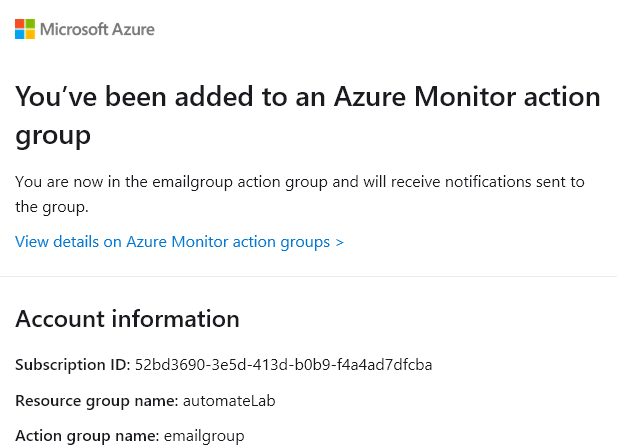

---
lab:
  title: 'Lab 12: Erstellen einer CPU-Statuswarnung für eine SQL Server-Instanz'
  module: Automate database tasks for Azure SQL
---

# Erstellen einer CPU-Statuswarnung für eine SQL Server-Instanz auf Azure

**Geschätzte Dauer**: 30 Minuten

Sie wurden als Senior Data Engineer eingestellt, um die Automatisierung der alltäglichen Datenbankverwaltungsvorgänge voranzutreiben. Diese Automatisierung soll sicherstellen, dass die Datenbanken für AdventureWorks weiterhin mit maximaler Leistung betrieben werden und Methoden für die Alarmierung auf der Grundlage bestimmter Kriterien bereitstellen.

## Erstellen einer Warnung, wenn eine CPU einen Durchschnitt von 80 Prozent überschreitet

1. Geben Sie in der Suchleiste am oberen Rand des Azure-Portals **SQL** ein, und wählen Sie **SQL-Datenbanken** aus. Wählen Sie den aufgelisteten Datenbanknamen **AdventureWorksLT** aus.

    

1. Navigieren Sie im Hauptblatt für die Datenbank **AdventureWorksLT** nach unten zum Abschnitt „Überwachung“. Wählen Sie **Warnungen** aus.

    

1. Wählen Sie **Warnungsregel erstellen** aus.

    

1. Wählen Sie in der Folie **Signal auswählen** die Option **CPU-Prozentsatz** aus.

    

1. Wählen Sie in der Folie **Signal konfigurieren** die Option **Statisch** als **Schwellenwerteigenschaft** aus. Überprüfen Sie dann, ob der **Operator** **Größer als** und der **Aggregationstyp** **Durchschnitt** ist. Geben Sie dann in **Schwellenwert** einen Wert von **80** ein. Wählen Sie **Fertig** aus.

    

1. Klicken Sie auf die Registerkarte **Actions** (Aktionen).

    

1. Wählen Sie auf der Registerkarte **Aktionen** die Option **Aktionsgruppe erstellen** aus.

    

1. Geben Sie auf dem Bildschirm **Aktionsgruppe** die Zeichenfolge **emailgroup** in das Feld **Name der Aktionsgruppe** ein. Wählen Sie dann **Weiter: Benachrichtigungen**.

    

1. Geben Sie auf der Registerkarte **Benachrichtigungen** die folgenden Informationen ein:

    - **Benachrichtigungstyp:** E-Mail/SMS-Nachricht/Pushnachricht/Sprachnachricht
        - **Hinweis:** Wenn Sie diese Option auswählen, wird ein Flyout für E-Mail/SMS-Nachricht/Pushnachricht/Sprachnachricht angezeigt. Überprüfen Sie die E-Mail-Eigenschaft, und geben Sie den Azure-Benutzernamen ein, mit dem Sie sich angemeldet haben.
    - **Name:** DemoLab

    

1. Klicken Sie auf **Überprüfen + erstellen** und dann auf **Erstellen**.

    

    **Hinweis:** Bevor Sie **Erstellen** auswählen, können Sie auch **Aktionsgruppe testen (Vorschau)** auswählen, um die Warnung zu testen.

1. Eine solche E-Mail wird an die von Ihnen eingegebene E-Mail-Adresse gesendet, sobald die Regel erstellt ist.

    

    Wenn die CPU-Auslastung im Durchschnitt 80 % überschreitet, wird eine E-Mail wie diese gesendet.

    

Sie können Warnungen so konfigurieren, dass Sie bei Erreichen eines Schwellenwerts für eine bestimmte Metrik (etwa Datenbankgröße oder CPU-Auslastung) per E-Mail oder Webhook benachrichtigt werden. Sie haben gerade gelernt, wie einfach es ist, Warnungen für Azure SQL-Datenbanken zu konfigurieren.
