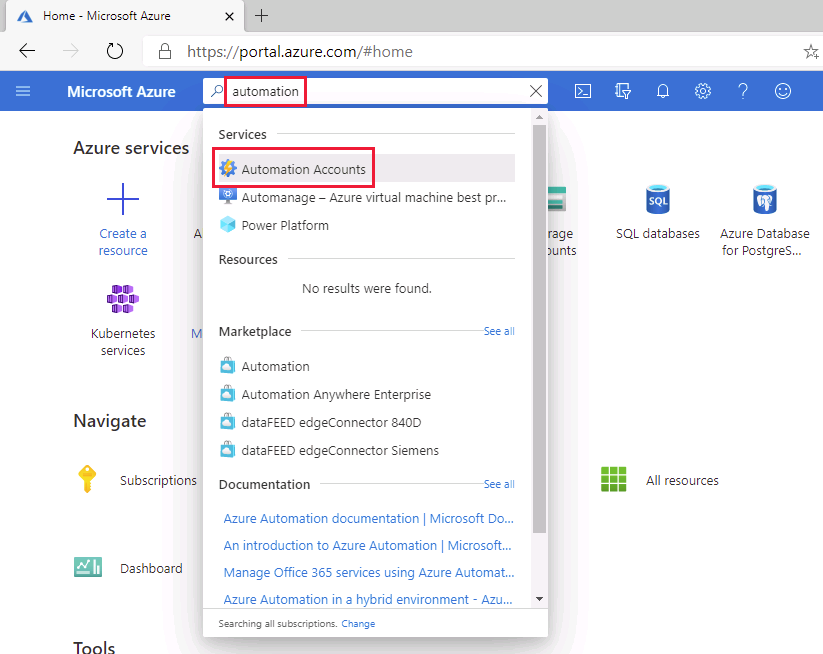
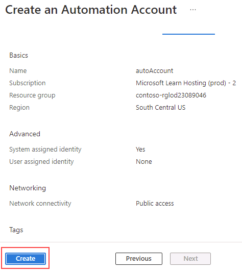
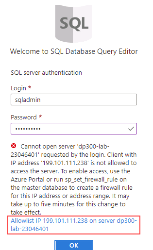
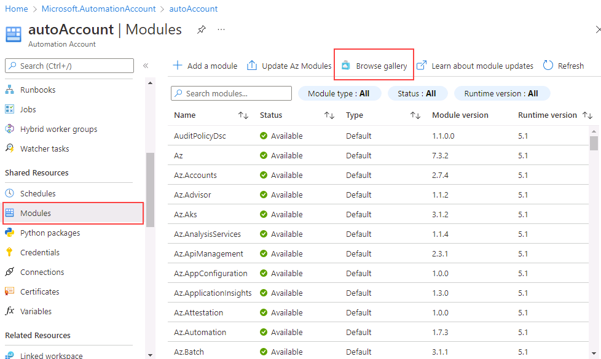
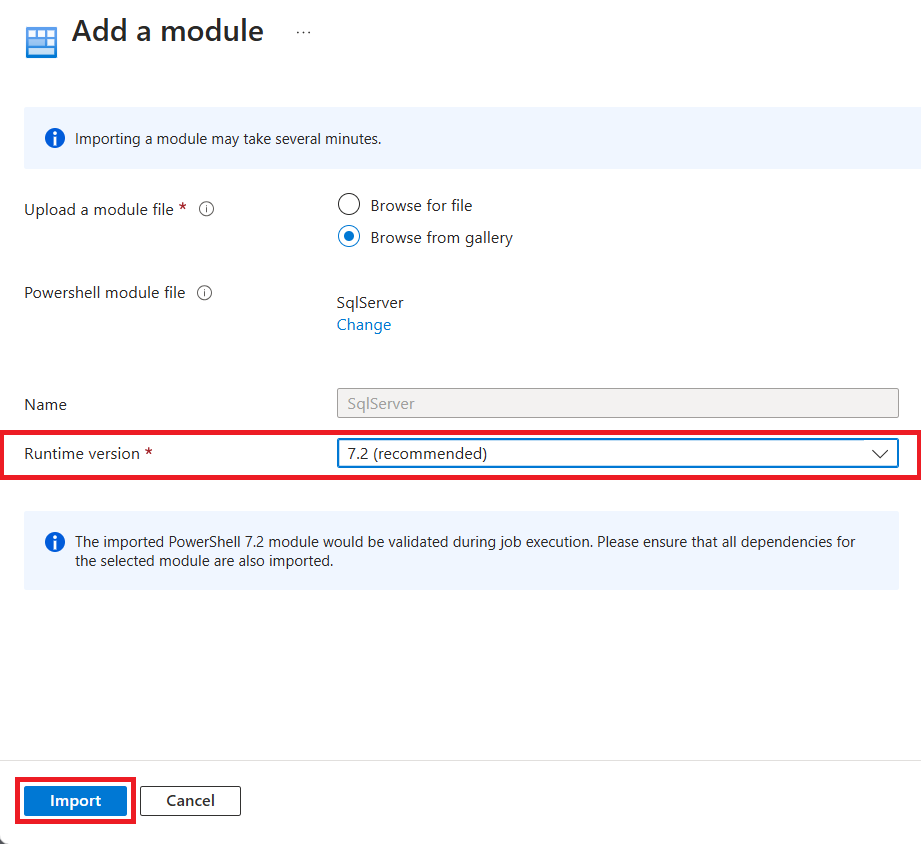
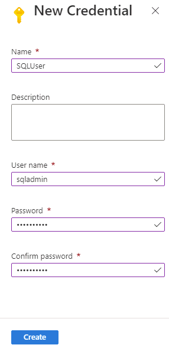
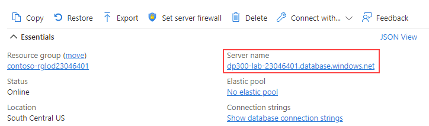
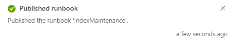
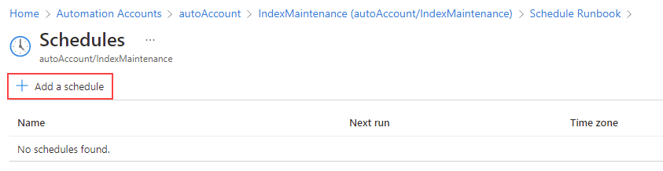

---
lab:
  title: 'Lab 13: Einsatz eines Runbooks zur Automatisierung der Neuerstellung von Indizes'
  module: Automate database tasks for Azure SQL
---

# Einsatz eines Runbooks zur Automatisierung der Neuerstellung von Indizes

**Geschätzte Dauer**: 30 Minuten

Sie wurden als Senior Data Engineer eingestellt, um die Automatisierung des täglichen Betriebs der Datenbankverwaltung voranzubringen. Diese Automatisierung soll sicherstellen, dass die Datenbanken für AdventureWorks weiterhin mit maximaler Leistung betrieben werden und Methoden für die Alarmierung auf der Grundlage bestimmter Kriterien bereitstellen. AdventureWorks nutzt SQL Server in Angeboten mit Infrastructure-as-a-Service- (IaaS) als auch Platform-as-a-Service- (PaaS).

## Automation-Konto erstellen

1. Starten Sie auf dem virtuellen Lab-Computer eine Browsersitzung, und navigieren Sie zu [https://portal.azure.com](https://portal.azure.com/). Stellen Sie eine Verbindung zum Portal her. Verwenden Sie dafür **Benutzernamen** und **Kennwort** von Azure, die auf der Registerkarte **Ressourcen** für diesen virtuellen Lab-Computer bereitgestellt werden.

    

1. Geben Sie im Azure-Portal in die Suchleiste *Automation* ein, und wählen Sie **Automation-Konten** aus den Suchergebnissen aus. Wählen Sie dann **+ Erstellen**.

    

1. Geben Sie auf der Seite **Automation-Konto erstellen** die folgenden Informationen ein, und wählen Sie dann **Überprüfen+ Erstellen** aus.

    - **Ressourcengruppe:** &lt;Ihre Ressourcengruppe&gt;
    - **Name:** autoAccount
    - **Speicherort:** Übernehmen Sie die Standardeinstellung.

    

1. Wählen Sie auf der Seite „Überprüfen“ die Option **Erstellen** aus.

    

    > [!NOTE]
    > Ihr Automation-Konto sollte in etwa drei Minuten erstellt werden.

## Herstellen einer Verbindung zu einer bestehenden Instanz von Azure SQL-Datenbank

1. Navigieren Sie im Azure-Portal zurück zu Ihrer Datenbank, indem Sie nach **SQL-Datenbanken** suchen.

    

1. Wählen Sie die SQL-Datenbank **AdventureWorksLT** aus.

    

1. Wählen Sie im Hauptabschnitt der Seite für Ihre SQL-Datenbank die Option **Abfrage-Editor (Vorschau)** aus.

    

1. Sie werden dazu aufgefordert, Anmeldeinformationen einzugeben, um sich bei Ihrer Datenbank anzumelden. Verwenden Sie diese Anmeldeinformation:

    - **Anmeldung:** sqladmin
    - **Kennwort**: P@ssw0rd01

1. Die folgende Fehlermeldung sollte angezeigt werden:

    

1. Wählen Sie den Link **Allowlist IP ...** aus, der am Ende der oben angezeigten Fehlermeldung angegeben wurde. Dadurch wird Ihre Client-IP automatisch als Firewall-Regel-Eintrag für Ihre SQL-Datenbank hinzugefügt.

    

1. Wechseln Sie zurück zum Abfrage-Editor, und klicken Sie auf **OK**, um sich bei Ihrer Datenbank anzumelden.

1. Öffnen Sie eine neue Registerkarte in Ihrem Browser, und navigieren Sie zur GitHub-Seite für das Skript [**AdaptativeIndexDefragmentation**](https://github.com/microsoft/tigertoolbox/blob/master/AdaptiveIndexDefrag/usp_AdaptiveIndexDefrag.sql). Wählen Sie anschließend **Raw** aus:

    

    Dadurch wird der Code in einem kopierbaren Format bereitgestellt. Wählen Sie den gesamten Text aus (<kbd>STRG</kbd> + <kbd>A</kbd>), und kopieren Sie ihn in die Zwischenablage (<kbd>STRG</kbd> + <kbd>C</kbd>).

    >[!NOTE]
    > Dieses Skript soll eine intelligente Defragmentierung für einen oder mehrere Indizes sowie die erforderliche Aktualisierung der Statistiken für eine oder mehrere Datenbanken durchführen.

1. Schließen Sie die GitHub-Registerkarte im Browser, und kehren Sie zum Azure-Portal zurück.

1. Fügen Sie den kopierten Text in den Bereich **Query 1** (Abfrage 1) ein.

    

1. Löschen Sie `USE msdb` und `GO` in den Zeilen 5 und 6 der Abfrage (im Screenshot hervorgehoben), und klicken Sie auf **Ausführen**.

1. Erweitern Sie den Ordner **Gespeicherte Prozeduren**, um anzuzeigen, welche Elemente erstellt wurden.

    

## Konfigurieren von Automation-Kontoressourcen

In den nächsten Schritte konfigurieren Sie die Ressourcen, die zur Vorbereitung der Runbook-Erstellung erforderlich sind. Wählen Sie dann **Automation-Konten** aus.

1. Geben Sie im Azure-Portal in das obere Suchfeld **Automation** ein.

    

1. Wählen Sie das von Ihnen erstellte Automation-Konto aus.

    

1. Wählen Sie auf dem Blatt „Automation“ im Abschnitt **Freigegebene Ressourcen** die Option **Module** aus. Wählen Sie **Katalog durchsuchen** aus.

    

1. Suchen Sie im Katalog nach **sqlserver**.

    

1. Wählen Sie **SqlServer** aus. Dadurch werden Sie zum nächsten Bildschirm weitergeleitet. Wählen Sie dann **Auswählen** aus.

    

1. Wählen Sie auf der Seite **Modul hinzufügen** die neueste verfügbare Laufzeitversion und dann **Importieren** aus. Dadurch wird das PowerShell-Modul in Ihr Automation-Konto importiert.

    

1. Sie müssen Anmeldeinformationen erstellen, um sich sicher bei Ihrer Datenbank anzumelden. Navigieren Sie auf dem Blatt des Automation-Kontos zum Abschnitt **Freigegebene Ressourcen**, und klicken Sie auf **Anmeldeinformationen**.

    

1. Wählen Sie **+ Anmeldeinformationen hinzufügen**, geben Sie die folgenden Informationen ein, und wählen Sie dann **Erstellen** aus.

    - Name: **SQLUser**
    - Benutzername: **sqladmin**
    - Kennwort: **P@ssw0rd01**
    - Kennwort bestätigen: **P@ssw0rd01**

    

## Erstellen eines PowerShell-Runbooks

1. Navigieren Sie im Azure-Portal zurück zu Ihrer Datenbank, indem Sie nach **SQL-Datenbanken** suchen.

    

1. Wählen Sie die SQL-Datenbank **AdventureWorksLT** aus.

    

1. Kopieren Sie auf der Seite **Überblick**, wie unten gezeigt, den **Servernamen** Ihrer Instanz von Azure SQL-Datenbank. (Ihr Servername sollte mit *dp300-lab* beginnen.) Sie werden ihn später wieder einfügen.

    

1. Geben Sie im Azure-Portal in das obere Suchfeld **Automation** ein.

    

1. Wählen Sie das von Ihnen erstellte Automation-Konto aus.

    

1. Scrollen Sie im Blatt des Automation-Kontos zum Abschnitt **Prozessautomatisierung**, und wählen Sie **Runbooks** und **+ Runbook erstellen**.

    

    >[!NOTE]
    > Wie wir bereits gelernt haben, wurden zwei Runbooks bereits erstellt. Diese wurden während der Bereitstellung des Automatisierungskontos automatisch erstellt.

1. Geben Sie den Runbooknamen **IndexMaintenance** und den Runbooktyp **PowerShell** ein. Wählen Sie die neueste verfügbare Laufzeitversion und dann **Erstellen** aus.

    

1. Nachdem das Runbook erstellt wurde, kopieren Sie den folgenden Powershell-Codeausschnitt und fügen ihn in den Runbook-Editor ein. Fügen Sie in der ersten Zeile des Skripts den Servernamen ein, den Sie in den obigen Schritten kopiert haben. Wählen Sie **Speichern** und dann **Veröffentlichen** aus.

    **Hinweis:** Überprüfen Sie, ob der Code korrekt kopiert wurde, bevor Sie ihn ausführen.

    ```powershell
    $AzureSQLServerName = ''
    $DatabaseName = 'AdventureWorksLT'
    
    $Cred = Get-AutomationPSCredential -Name "SQLUser"
    $SQLOutput = $(Invoke-Sqlcmd -ServerInstance $AzureSQLServerName -UserName $Cred.UserName -Password $Cred.GetNetworkCredential().Password -Database $DatabaseName -Query "EXEC dbo.usp_AdaptiveIndexDefrag" -Verbose) 4>&1

    Write-Output $SQLOutput
    ```

    

1. Wenn alles gut geht, sollten Sie eine Erfolgsmeldung erhalten.

    

## Erstellen eines Zeitplans für ein Runbook

Als Nächstes planen Sie die Ausführung des Runbooks in regelmäßigen Abständen.

1. Wählen Sie im linken Navigationsbereich Ihres Runbooks **IndexMaintenance** unter **Ressourcen** die Option **Zeitpläne**. Klicken Sie dann auf **+ Zeitplan hinzufügen**.

    

1. Wählen Sie **Zeitplan mit Runbook verknüpfen** aus.

    

1. Wählen Sie **+ Zeitplan hinzufügen** aus.

    

1. Geben Sie, falls gewünscht, einen beschreibenden Namen für den Zeitplan und eine Beschreibung ein.

1. Legen Sie die Startzeit auf den Folgetag um **4:00 Uhr** morgens und die Zeitzone auf **Pacific Time** fest. Legen Sie als Wiederholungsintervall **1** Tag fest. Konfigurieren Sie kein Ablaufdatum.

    

1. Klicken Sie auf **Erstellen** und dann auf **OK**.

1. Der Zeitplan ist nun erstellt und mit dem Runbook verknüpft. Wählen Sie **OK** aus.

    

Azure Automation bietet einen cloudbasierten Automatisierungs- und Konfigurationsdienst, der eine konsistente Verwaltung Ihrer Azure- und sonstigen Umgebungen unterstützt.

In dieser Übung haben Sie die Defragmentierung von Indizes in einer SQL Server-Datenbank automatisiert. Sie wird täglich um 4:00 Uhr ausgeführt.