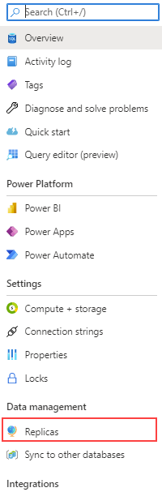
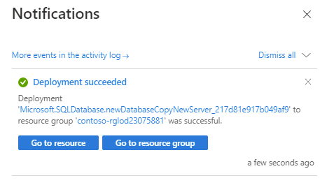

---
lab:
  title: 'Lab 14: Konfigurieren der Georeplikation für Azure SQL-Datenbank'
  module: Plan and implement a high availability and disaster recovery solution
---

# Konfigurieren der Georeplikation für Azure SQL-Datenbank

**Geschätzte Dauer**: 30 Minuten

Als DBA in AdventureWorks müssen Sie die Georeplikation für Azure SQL Database aktivieren und sicherstellen, dass sie ordnungsgemäß funktioniert. Darüber hinaus verlagern Sie die Datenbank in einem Failover manuell über das Portal in eine andere Region.

## Aktivieren der Georeplikation

1. Starten Sie auf dem virtuellen Lab-Computer eine Browsersitzung, und navigieren Sie zu [https://portal.azure.com](https://portal.azure.com/). Stellen Sie eine Verbindung zum Portal her. Verwenden Sie dafür **Benutzernamen** und **Kennwort** von Azure, die auf der Registerkarte **Ressourcen** für diesen virtuellen Lab-Computer bereitgestellt werden.

    

1. Navigieren Sie im Azure-Portal zurück zu Ihrer Datenbank, indem Sie nach **SQL-Datenbanken** suchen.

    

1. Wählen Sie die SQL-Datenbank **AdventureWorksLT** aus.

    

1. Wählen Sie auf dem Blatt für die Datenbank im Bereich **Datenverwaltung** die Option **Replikate** aus.

    

1. Wählen Sie **+ Replikat erstellen** aus.

    

1. Wählen Sie auf der Seite **SQL-Datenbank erstellen – Georeplikat** unter **Server** den Link **Neu erstellen** aus.

    

    >[!NOTE]
    > Wenn Sie einen neuen Server zum Hosten der sekundären Datenbank erstellen, können Sie die obige Fehlermeldung ignorieren.

1. Geben Sie auf der Seite **SQL-Datenbank-Server erstellen** einen eindeutigen **Servernamen** Ihrer Wahl, eine gültige **Serveradministratoranmeldung** und ein sicheres **Kennwort** ein. Wählen Sie einen **Speicherort** als Zielbereich und dann **OK** aus, um den Server zu erstellen.

    

1. Wählen Sie zurück auf der Seite **SQL-Datenbank erstellen – Georeplikat** die Option **Bewerten + Erstellen** aus.

    

1. Wählen Sie **Erstellen** aus.

    

1. Der sekundäre Server und die Datenbank werden nun erstellt. Sie können den Status über das Benachrichtigungssymbol im oberen Bereich des Portals überprüfen. 

    

1. Im Erfolgsfall wechselt es von **Bereitstellung in Bearbeitung** zu **Bereitstellung erfolgreich**.

    

## Failover der SQL-Datenbank in eine sekundäre Region

Nachdem das Azure SQL-Datenbank-Replikat erstellt wurde, führen Sie ein Failover aus.

1. Navigieren Sie zur Seite „SQL-Server“, und beachten Sie den neuen Server in der Liste. Wählen Sie den sekundären Server aus (der Servername kann bei Ihnen abweichen).

    

1. Klicken Sie auf dem Blatt „SQL Server“ im Abschnitt **Einstellungen** auf **SQL-Datenbanken**.

    

1. Wählen Sie auf dem Hauptblatt für die SQL-Datenbank unter **Datenverwaltung** die Option **Replikate** aus.

    

1. Beachten Sie, dass die Verbindung zur Georeplikation nun hergestellt ist.

    

1. Wählen Sie das Menü **...** für den sekundären Server aus, und wählen Sie **Erzwungenes Failover**.

    

    > [!NOTE]
    > Beim erzwungenen Failover wird die sekundäre Datenbank in die primäre Rolle versetzt. Alle Sitzungen werden während dieses Vorgangs getrennt.

1. Wenn Sie in einer Warnmeldung dazu aufgefordert werden, klicken Sie auf **Ja**.

    

1. Der Status des primären Replikats ändert sich in **Ausstehend** und der des sekundären zu **Failover**. 

    

    > [!NOTE]
    > Dieser Vorgang kann einige Minuten dauern. Wenn er abgeschlossen ist, werden die Rollen getauscht, wobei das sekundäre Replikat zum neuen primären wird und das alte primäre zum sekundären.

Die lesbare sekundäre Datenbank kann sich in derselben Azure-Region befinden wie die primäre, oder, was häufiger der Fall ist, in einer anderen Region. Diese Art von lesbaren Sekundärdatenbanken werden auch als Geo-Sekundärdatenbanken oder Geo-Replikate bezeichnet.

Sie haben nun gelernt, wie Sie Geo-Replikate für Azure SQL Database aktivieren und sie per manuellem Failover über das Portal in eine andere Region verlagern können.
