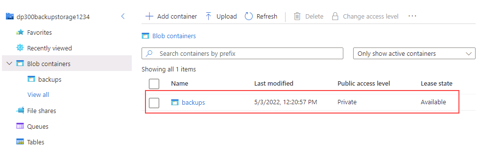
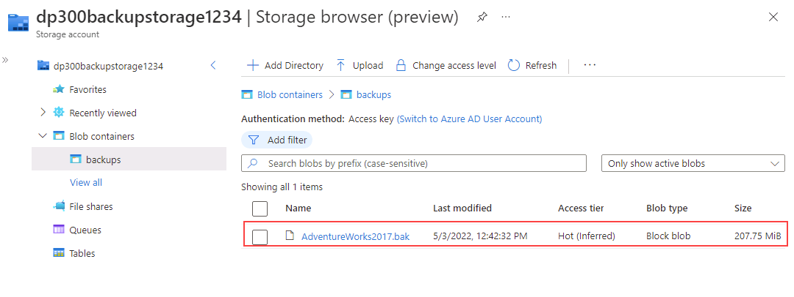

---
lab:
  title: 'Lab 15: Sichern und Wiederherstellen über eine URL'
  module: Plan and implement a high availability and disaster recovery solution
---

# Erstellen von Sicherungen über URLs

**Geschätzte Dauer: 30 Minuten**

Als DBA für AdventureWorks müssen Sie eine Datenbank unter einer URL in Azure sichern und sie nach einem menschlichen Fehler aus dem Azure-Blob-Speicher wiederherstellen.

## Wiederherstellen einer Datenbank

1. Laden Sie die Datenbanksicherungsdatei unter **https://github.com/MicrosoftLearning/dp-300-database-administrator/blob/master/Instructions/Templates/AdventureWorks2017.bak** in den Pfad **C:\LabFiles\HADR** auf dem virtuellen Labor-Computer herunter. (Erstellen Sie die Ordnerstruktur, falls sie nicht vorhanden ist.)

    

1. Wählen Sie die Windows-Starttaste und geben Sie SSMS ein. Wählen Sie **Microsoft SQL Server Management Studio 18** aus der Liste aus.  

    

1. Beim Öffnen von SSMS wird das Dialogfeld **Mit Server verbinden** vorab mit dem Standardinstanznamen ausgefüllt. Wählen Sie **Verbinden**.

    

1. Wählen Sie den Ordner **Datenbanken** und dann **Neue Abfrage** aus.

    

1. Kopieren Sie im Fenster „Neue Abfrage“ den folgenden T-SQL, und fügen Sie ihn ein. Führen Sie die Abfrage aus, um die Datenbank wiederherzustellen.

    ```sql
    RESTORE DATABASE AdventureWorks2017
    FROM DISK = 'C:\LabFiles\HADR\AdventureWorks2017.bak'
    WITH RECOVERY,
          MOVE 'AdventureWorks2017' 
            TO 'C:\LabFiles\HADR\AdventureWorks2017.mdf',
          MOVE 'AdventureWorks2017_log'
            TO 'C:\LabFiles\HADR\AdventureWorks2017_log.ldf';
    ```

    **Hinweis:** Der Name und der Pfad der Datenbanksicherungsdatei sollten mit der in Schritt 1 heruntergeladenen Datei übereinstimmen, andernfalls wird der Befehl fehlschlagen.

1. Nach beendeter Wiederherstellung sollte eine Erfolgsmeldung angezeigt werden.

    

## Konfigurieren von „Sichern unter URL“

1. Starten Sie auf dem virtuellen Lab-Computer eine Browsersitzung, und navigieren Sie zu [https://portal.azure.com](https://portal.azure.com/). Stellen Sie eine Verbindung zum Portal her. Verwenden Sie dafür **Benutzernamen** und **Kennwort** von Azure, die auf der Registerkarte **Ressourcen** für diesen virtuellen Lab-Computer bereitgestellt werden.

    

1. Öffnen Sie eine **Cloud Shell**-Eingabeaufforderung, indem Sie das unten abgebildete Symbol auswählen.

    

1. In der unteren Hälfte des Portals sehen Sie möglicherweise eine Meldung, die Sie zur Azure Cloud Shell begrüßt, wenn Sie noch keine Cloud Shell verwendet haben. Wählen Sie **Bash** aus.

    

1. Wenn Sie bisher keine Cloud Shell verwendet haben, müssen Sie einen Speicher konfigurieren. Wählen Sie **Erweiterte Einstellungen anzeigen** aus. (Möglicherweise wurde Ihnen ein anderes Abonnement zugewiesen.)

    

1. Verwenden Sie die vorhandene **Ressourcengruppe**, und geben Sie neue Namen für **Speicherkonto** und **Dateifreigabe** an, wie im folgenden Dialogfeld gezeigt. Notieren Sie sich den Namen der **Ressourcengruppe**. Er sollte mit *contoso-rg* beginnen. Klicken Sie anschließend auf **Speicher erstellen**.

    **Hinweis:** Der Name Ihres Speicherkontos muss eindeutig sein und darf nur Kleinbuchstaben und keine Sonderzeichen enthalten. Geben Sie einen eindeutigen Namen an.

    

1. Sobald Sie fertig sind, sehen Sie eine Aufforderung ähnlich der folgenden. Stellen Sie sicher, dass in der oberen linken Ecke des Cloud Shell-Bildschirms **Bash** angezeigt wird.

    

1. Erstellen Sie ein neues Speicherkonto über die CLI, indem Sie den folgenden Befehl in der Cloud Shell ausführen. Verwenden Sie den Namen der Ressourcengruppe, die mit **contoso-rg** beginnt und die Sie sich weiter oben notiert haben.

    > [!NOTE]
    > Ändern Sie den Namen der Ressourcengruppe (Parameter **-g**), und geben Sie einen eindeutigen Namen für das Speicherkonto (Parameter **-n**) an.

    ```bash
    az storage account create -n "dp300backupstorage1234" -g "contoso-rglod23149951" --kind StorageV2 -l eastus2
    ```

    

1. Als Nächstes rufen Sie die Schlüssel für Ihr Speicherkonto ab, die Sie in den nachfolgenden Schritten verwenden werden. Führen Sie in der Cloud Shell den folgenden Code aus. Verwenden Sie dabei den eindeutigen Namen des Speicherkontos und der Ressourcengruppe.

    ```bash
    az storage account keys list -g contoso-rglod23149951 -n dp300backupstorage1234
    ```

    Ihr Kontoschlüssel ist in den Ergebnissen des obigen Befehls enthalten. Stellen Sie sicher, dass Sie denselben Namen (hinter **-n**) und dieselbe Ressourcengruppe (hinter **-g**) verwenden, die Sie im vorherigen Befehl verwendet haben. Kopieren Sie den zurückgegebenen Wert für **key1** (ohne die Anführungszeichen), wie hier gezeigt:

    

1. Beim Sichern einer Datenbank in SQL Server unter einer URL wird ein Container innerhalb eines Speicherkontos verwendet. In diesem Schritt erstellen Sie einen Container speziell für die Speicherung von Sicherungskopien. Führen Sie dazu die folgenden Befehle aus.

    ```bash
    az storage container create --name "backups" --account-name "dp300backupstorage1234" --account-key "storage_key" --fail-on-exist
    ```

    Dabei ist **dp300backupstorage1234** der eindeutige Name des Speicherkontos, der beim Erstellen verwendet wird, und**storage_key** der oben generierte Schlüssel. Die Ausgabe sollte **true** zurückgeben.

    

1. Um zu überprüfen, ob die Container-Backups ordnungsgemäß erstellt wurden, führen Sie Folgendes aus:

    ```bash
    az storage container list --account-name "dp300backupstorage1234" --account-key "storage_key"
    ```

    Dabei ist **dp300backupstorage1234** der eindeutige Name des Speicherkontos, der beim Erstellen verwendet wird, und **storage_key** der generierte Schlüssel. Die zurückgegebene Ausgabe sollte in etwa wie folgt aussehen:

    

1. Aus Sicherheitsgründen ist eine Shared Access Signature (SAS) auf Containerebene erforderlich. Dies kann über Cloud Shell oder PowerShell erfolgen. Führen Sie Folgendes aus:

    ```bash
    az storage container generate-sas -n "backups" --account-name "dp300backupstorage1234" --account-key "storage_key" --permissions "rwdl" --expiry "date_in_the_future" -o tsv
    ```

    Dabei ist **dp300backupstorage1234** der Name des Speicherkontos ist, das Sie erstellt haben, **storage_key** der generierte Schlüssel und **date_in_the_future** ein späterer Zeitpunkt als jetzt. **date_in_the_future** muss in UTC sein. Ein Beispiel ist **2021-12-31T00:00Z**, was bedeutet, dass es am 31. Dezember 2020 um Mitternacht abläuft.

    Die zurückgegebene Ausgabe sollte in etwa wie folgt aussehen. Kopieren Sie die gesamte SAS, und fügen Sie sie in **Editor** ein. Sie wird in der nächsten Aufgabe verwendet.

    

## Erstellen von Anmeldeinformationen

Nun, da die Funktionalität konfiguriert ist, können Sie eine Sicherungsdatei als Blob in Azure Storage Account generieren.

1. Starten Sie **SQL Server Management Studio (SSMS)**.

1. Sie werden aufgefordert, eine Verbindung mit SQL Server herzustellen. Vergewissern Sie sich, dass die **Windows-Authentifizierung** ausgewählt ist, und wählen Sie **Verbinden** aus.

1. Wählen Sie **Neue Abfrage** aus.

1. Erstellen Sie die Anmeldeinformationen, die für den Zugriff auf Speicher in der Cloud verwendet werden sollen, mit dem folgenden Transact-SQL-Code. Geben Sie die entsprechenden Werte ein, und wählen Sie dann **Ausführen** aus.

    ```sql
    IF NOT EXISTS  
    (SELECT * 
        FROM sys.credentials  
        WHERE name = 'https://<storage_account_name>.blob.core.windows.net/backups')  
    BEGIN
        CREATE CREDENTIAL [https://<storage_account_name>.blob.core.windows.net/backups]
        WITH IDENTITY = 'SHARED ACCESS SIGNATURE',
        SECRET = '<key_value>'
    END;
    GO  
    ```

    Dabei sind beide Vorkommen von **<storage_account_name>** der erstellte eindeutige Speicherkontoname und **<key_value>** der am Ende der vorherigen Aufgabe in diesem Format generierte Wert:

    `'se=2020-12-31T00%3A00Z&sp=rwdl&sv=2018-11-09&sr=csig=rnoGlveGql7ILhziyKYUPBq5ltGc/pzqOCNX5rrLdRQ%3D'`

1. Sie können überprüfen, ob die Anmeldeinformationen erfolgreich erstellt wurden. Navigieren Sie dafür im Objekt-Explorer zu **Sicherheit > Anmeldeinformationen**.

    

1. Wenn Sie sich vertippt haben und die Anmeldeinformationen neu erstellen müssen, können Sie sie mit dem folgenden Befehl löschen, wobei Sie darauf achten müssen, den Namen des Speicherkontos zu ändern:

    ```sql
    -- Only run this command if you need to go back and recreate the credential! 
    DROP CREDENTIAL [https://<storage_account_name>.blob.core.windows.net/backups]  
    ```

## Erstellen von Sicherungen über URLs

1. Sichern Sie die Datenbank **AdventureWorks2017** mit dem folgenden Befehl in Transact-SQL in Azure:

    ```sql
    BACKUP DATABASE AdventureWorks2017   
    TO URL = 'https://<storage_account_name>.blob.core.windows.net/backups/AdventureWorks2017.bak';
    GO 
    ```

    Dabei ist **<storage_account_name>** der erstellte eindeutige Speicherkontoname. Die zurückgegebene Ausgabe sollte in etwa wie folgt aussehen.

    

    Wenn etwas falsch konfiguriert wurde, wird eine Fehlermeldung ähnlich der folgenden angezeigt:

    

    Wenn ein Fehler auftritt, überprüfen Sie, ob Sie sich bei der Erstellung der Anmeldeinformationen vertippt haben und ob alles erfolgreich erstellt wurde.

## Überprüfen der Sicherung über Azure CLI

Um festzustellen, ob die Datei tatsächlich in Azure vorhanden ist, können Sie den Storage-Explorer (Vorschau) oder die Azure Cloud Shell verwenden.

1. Starten Sie einen Webbrowser, und navigieren Sie zu [https://portal.azure.com](https://portal.azure.com/). Stellen Sie eine Verbindung zum Portal her. Verwenden Sie dafür **Benutzernamen** und **Kennwort** von Azure, die auf der Registerkarte **Ressourcen** für diesen virtuellen Lab-Computer bereitgestellt werden.

1. Verwenden Sie die Azure Cloud Shell, um diesen Azure CLI-Befehl auszuführen:

    ```bash
    az storage blob list -c "backups" --account-name "dp300backupstorage1234" --account-key "storage_key" --output table
    ```

    Verwenden Sie denselben eindeutigen Speicherkontonamen (nach dem **--account-name**) und Kontoschlüssel (nach dem **--account-key**), den Sie in den vorherigen Befehlen verwendet haben.

    

    Wir können bestätigen, dass die Sicherungsdatei erfolgreich erstellt wurde.

## Überprüfen der Sicherung im Storage-Explorer

1. Um den Storage-Explorer (Vorschau) zu verwenden, wählen Sie auf der Startseite im Azure-Portal **Speicherkonten** aus.

    

1. Wählen Sie den eindeutigen Speicherkontonamen aus, den Sie für die Sicherungen angelegt haben.

1. Wählen Sie im linken Navigationsbereich **Storage-Explorer (Vorschau)** aus. Erweitern Sie die Option **Blobcontainer**.

    

1. Wählen Sie **Sicherungen** aus.

    

1. Beachten Sie, dass die Sicherungsdatei im Container gespeichert ist.

    

## Wiederherstellen über URL

In dieser Aufgabe lernen Sie, wie Sie eine Datenbank aus einem Azure-Blob-Speicher wiederherstellen können.

1. Wählen Sie in **SQL Server Management Studio (SSMS)** die Option **Neue Abfrage** aus, fügen Sie dann die folgende Abfrage ein, und führen Sie sie aus.

    ```sql
    USE AdventureWorks2017;
    GO
    SELECT * FROM Person.Address WHERE AddressId = 1;
    GO
    ```

    

1. Führen Sie diesen Befehl aus, um den Namen dieses Kunden zu ändern.

    ```sql
    UPDATE Person.Address
    SET AddressLine1 = 'This is a human error'
    WHERE AddressId = 1;
    GO
    ```

1. Führen Sie **Schritt 1** erneut aus, um zu überprüfen, ob die Adresse geändert wurde. Stellen Sie sich nun vor, jemand hätte Tausende oder Millionen von Zeilen ohne WHERE-Klausel geändert – oder mit der falschen WHERE-Klausel. Eine der Lösungen beinhaltet die Wiederherstellung der Datenbank aus der letzten verfügbaren Sicherung.

    

1. Um die Datenbank wiederherzustellen und sie auf den Stand vor der irrtümlichen Änderung des Kundennamens zu bringen, führen Sie Folgendes aus.

    **Hinweis:** Die Syntax **SET SINGLE_USER WITH ROLLBACK IMMEDIATE** setzt alle offenen Transaktionen zurück. Dies kann verhindern, dass die Wiederherstellung aufgrund aktiver Verbindungen fehlschlägt.

    ```sql
    USE [master]
    GO

    ALTER DATABASE AdventureWorks2017 SET SINGLE_USER WITH ROLLBACK IMMEDIATE
    GO

    RESTORE DATABASE AdventureWorks2017 
    FROM URL = 'https://<storage_account_name>.blob.core.windows.net/backups/AdventureWorks2017.bak'
    GO

    ALTER DATABASE AdventureWorks2017 SET MULTI_USER
    GO
    ```

    Dabei ist **<storage_account_name>** der eindeutige Name des Speicherkontos, den Sie erstellt haben.

    Die Ausgabe sollte in etwa so aussehen:

    

1. Führen Sie **Schritt 1** erneut aus, um zu überprüfen, ob der Kundenname wiederhergestellt wurde.

    

Es ist wichtig, die jeweiligen Komponenten und Interaktionen zwischen den einzelnen Komponenten zu verstehen, um Daten mit dem Azure Blob Storage-Dienst zu sichern oder wiederherzustellen.

Sie haben nun gesehen, dass Sie eine Datenbank unter einer URL in Azure sichern und bei Bedarf wiederherstellen können.
